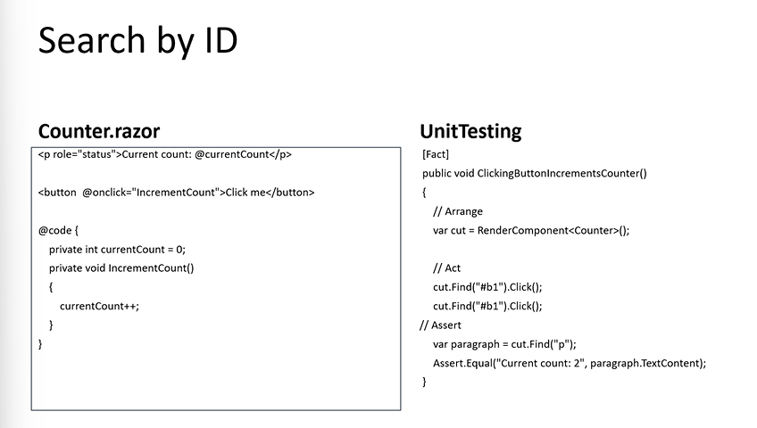
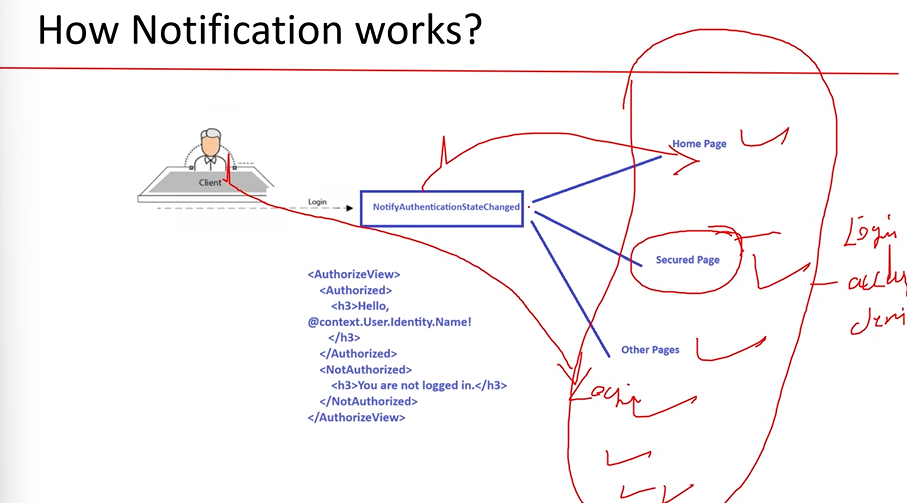
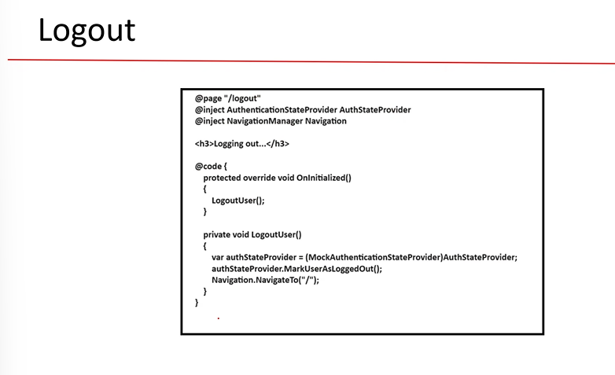

# Blazor

- Blazor is a powerful .Net Frontend web framework for creating single page web application.
- Blazer was delevoped by Microsoft.
- Blazer uses c# in frontend.
- now in blazor c# can run inside the browser applicaition.
- eariler c# was only used for backend but now c# was also used in forntend using blazor.
- Single page applciation(SPA) i.e blazor was used for SPA
- The entire website is single page. is called SPA.
- there ate two ways to create an application
  1. Multi page application
  2. Single Page Application
- each website with multiple pages are present like login,home,feedback..etc
- SPA means there is only one single page for an applicaiton and the content in that page will only gets changed dynamically.
- means single page will be gets updated dynamically but not redirects to the another page.
- 
- blazor=browser+Razor
- 
- Component has dynamic content(data) which will changes the content continously
- pages means the data is in static -
- teleric is used for blazor ro create rich UI's

### Hosting

- 

### Blazor Web Assembly(CSH)

- client side hosting.
  - all the pages will come form the web server.
  - all the compilation will be happend in the browser.

### Blazor Server(SSH)

- server side hosting
  - web server will process the page i.e Kestrol will process and compile the page.
  - the browser will displays the result which is comes from the webserver.
- c# code will works in the browser based on the below image
- 

##### a small runtine i.e clr is downloaded in the browser which comes with code.which is useful to compile the c# codes.

- in blazor web assmebly the clr along with code is sent to the browser there it self it will compile the c# code in the browser.
- the soruce code is compiled in into the il format i.e dll which is done by code compiler and that dll file is sent to the browser and the browser will only understands the il code beacuse of the runtime was downloaded in the browser which will converts the il code into binary format.[Blazer web assembly ]

- [blazor Server]
  

### Project Structure

- 

### Code Behind

- the code which we write c# code in the razer page can be write it here.
- we need to create a class with same name as razer page name like page_name.razor.cs
- the class is created by right clicking on the pages.
- if the file name is not matches with the razor name we use @inherits class_name in the razor.

### Routing

- 
- route for the razors.
- using nav link we can navigate to the another pages.
- instead of a tag we use nav tag navlink because it will not reloads the page.
- 
- 
- if we want to pass the parameters to the next page we need to create a property with the same name in the next page.
- use the attribute named [supplyparamterFromQuery] below the property.

```c#
@page "/page1"
@inject NavigationManager obj;
<h3>page1</h3>

@code {
    public void show()
    {
        obj.NavigateTo("/page2?pid=001");
    }
}
<NavLink class="nav-link" href="page2?pid=001">
<span>Page2</span>
</NavLink>
<input type="button" value="click" @onclick="show"/>
@page "/page2"
<h3>page2</h3>

@code {
    [SupplyParameterFromQuery]
    public string ? pid{ get; set; }
}
<div>para is @pid
</div>
```

- 

- blazor cannot interact with the database so we need to create the web api to intwera ct weith the database.
- a web api project is used ot interact with the database .
- in blazer to connect with the web api project we use a code that is given below

```c#
 public async Task<HttpResponseMessage> AddUser(User data)
 {
  // we write this code in the class file in the razor pages in the property class.
     var res = await c.PostAsJsonAsync<User>("https://localhost:7020/api/Cinema/Register", data);// here based on the rest protocol we use the get post methods.
     // we used the asyn to increase the performance.
     return res;
 }//we write this code to connetc with the webapi method
```

- we stored the data in the user objects using the bind value in the text box then we stored them user object then we need to pass the user object to the web api controller
- so now we need a connection b/w the webapi and the razor pages by writing the code in webapi program.cs
- 
- 

```C#
@inject navigationmangaer obj;//menas it is a dependency injection
using system.net.http.json
httpclient obj;//which is used to work with crud operaitons
async //where ever asyn is there await should be there this are combinations
await //
//example for async and await
public void hello()
{
  int c = ob.method(10,20)
  cw("sum:"+c);
}
method(int a, int b)
{
  return a+b;
}
//task means that method is used another processor
```


- instead of creating objects for a class we create an interface and then we create a class for the methods present in the interface and then using builder.service.addscoped<interface_name,class_name> which will connects the interface and class now to use these interface ir class we write @inject interface_name obj; which has all the methods present in the interface.

### Blazor Language Features

#### javascript interop(sharing the resources)

- using the javascript methods in dotnent instead create the same method in dotnet we use the methods present in the js.
- 
- 
- 
- 
  ------------------------\*
- 
- 
- its not possible to use the parameter in the parent class if we not mention the attribute.
- all the events are tirggered by the client the server will just delcare the event . to raise the event the cleint will decide it.

### SignalR

- is a javascript library
- 
- updates the page automatically
- all the places will get updated means the clients whatever devices they use it should be updated anywhere.

### Unit testing

- 
- Bunit is a pacakage used to perform unit testing only works on razor code and c# only.
- Xinit project is supposed to be created.
- 
- instance is used to call that methods.
- for html tags we use find method instead of instance.
- 
- the text in the paragraph is TexCcontent.
- 

### Authentication

- 
- we can create our own authetication as our way we want
- 
- 
- the default authentication in the blazor project is anonomus authentication.
- Authentication State provider is a base class which provides authentication state information. this class contains a method by name notifyAuthenticationStateChanged which is used notify wheather the user is authenticate or not.
- 
- this method tells the state of the user means after the user logged in this methods says that the state of the user is changed which means the user is logged in i.e the valid user.
- AuthenticateState : represents the current state of the user this class has a method called is isauthenticate which says the user is valid or not means the admin or any other role.
- authorizeveiw is a tag that conditonally displays UI content based on the user's authentication.
- 
- it has the html code which it will display the message based on the user logging the code is displayed.
- 
- 
- 
- 

----------------\*

1. tokens
2. database connection in the appsetting.json

```c#
 moviebookingdbContext m;
 ILogger<moviebookingdbContext> _logger;
 private readonly IMemoryCache cache;

 public CinemaController(moviebookingdbContext m1,IMemoryCache lm, ILogger<moviebookingdbContext> l)
 {
     m = m1;
     _logger = l;
     cache = lm;

 }
 [Route("sh")]
 [HttpGet]
 public IActionResult ShowMo()
 {
     //this is the to store in the cache memory
     cache.Set("name", "raj");//key and value
     // this is the logic to read from the cache memory
     string st = cache.Get("name").ToString();
     return Ok(st);
 }
 // to store in output cache.
  [Route("showmovies")]
 [HttpGet]
 public IActionResult Showmovies()
 {
     //var res = m.Movies.Select(t=>t).ToList();
     //_logger.LogInformation(("new database connection established") + DateTime.Now.ToString());
     //return Ok(res);
     var cacheKey = "mov";
     if (cache.TryGetValue(cacheKey, out List<Movie>? data))
     {


         return Ok(data);

     }
     else
     {
         var res = (from t in m.Movies
                    select t).ToList();
         var cacheOptions = new MemoryCacheEntryOptions()
            .SetAbsoluteExpiration(TimeSpan.FromSeconds(300));
         // .SetPriority(CacheItemPriority.NeverRemove)
         // .SetSize(2048);

         cache.Set(cacheKey, res, cacheOptions);

         return Ok(res);
     }

 }
 var configuration = builder.Configuration;//u are reading the context from the appsetting.json
var a = builder.Configuration.GetConnectionString("moviebookingdb");//readvalues from moviebbokingsb
builder.Services.AddDbContext<moviebookingdbContext>(o => o.UseSqlServer(a));// path menthonied iin json is used here
builder.Services.AddMemoryCache();// to add into the cache.
```

### link for notes:

https://drive.google.com/file/d/1QzkeeSI6gLxwKR80GD2P3TOTVzpAfXWO/view?usp=sharing
