# Dockers(Container)

- 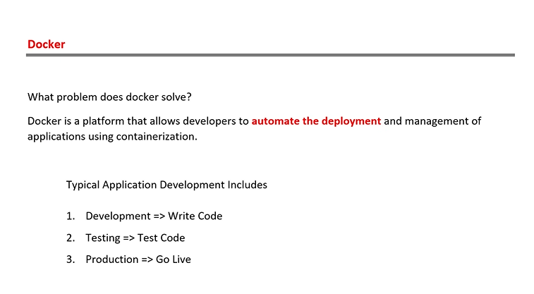
- it is mainly used for automate deployment
- the docker will comes into picture only when the deployment happends.
- there might me n number of problems when developing the application so, to solve that problem we use this docker.which will helps to resolve the problem.

### Software Integration test:

- Unit testing : it is done by the testers on each unit i.e on each method.
- integration testing : it is done by the developers in which each methods and funcitons are combined and testing is perfomed.
- Load tetsing and performance testing

### User Acceptance Test:

- User acceptance test : it is done at last by clients environment if it accepted then only the code is accepted then rejected.

- 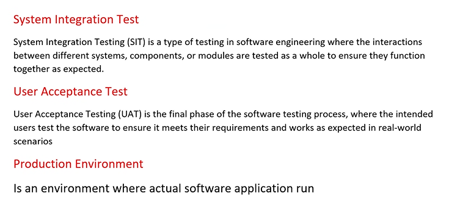
- 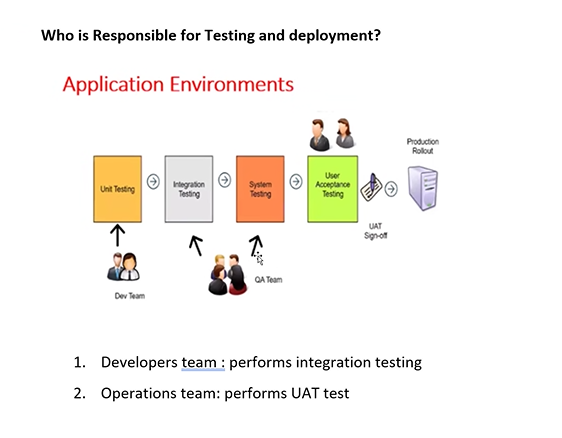
- there might be certian situaitons where the code will work in developer environment but may not work in clients environment because of the following reasons
- 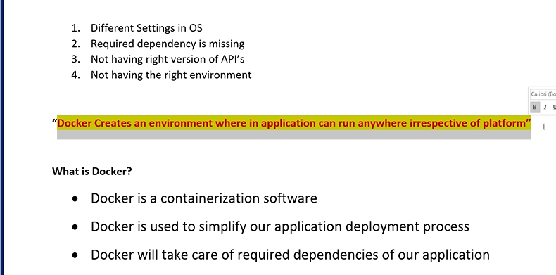

#### Docker creates an environment where in application can run anywhere irrespective of platform.

- 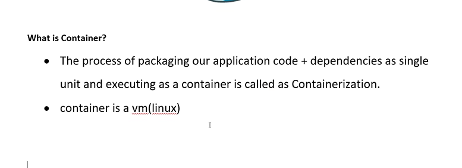
- 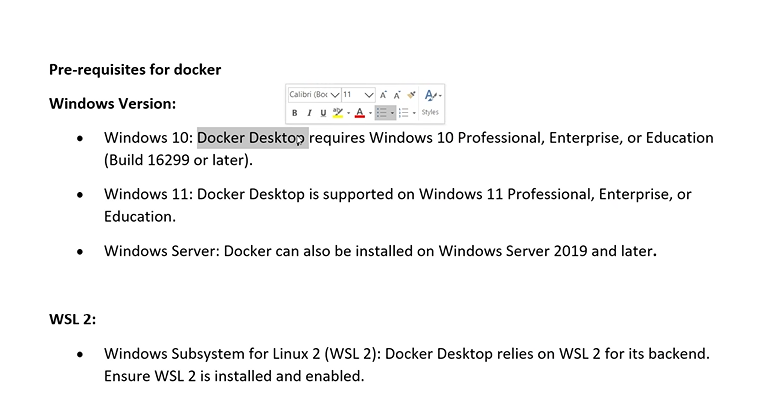

### Windows subsystem for linux(WSL) is requried for dockers

- 3 things are required to run the docker they are
- containers
- WSL
- Hyper-V

### Container :

- it contains all the required dependencies like(runtime+packages+configurations+settings+application)

#### How to create a containers?

- containers are always created from images.
  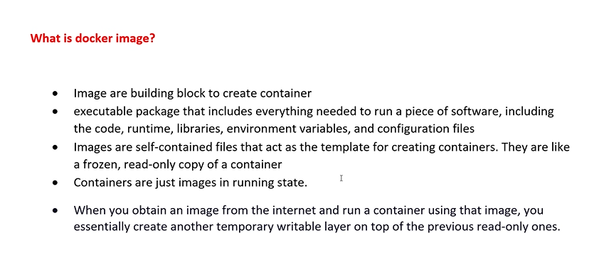
- how to create the image?
- images are created from docker file
- how docker files are created?
- docker files contains all configurations and dependencies injection which required to the application.
  docker file--> blue print
  like in oops concept a class can have many objects similar to it an image can have many containers
- 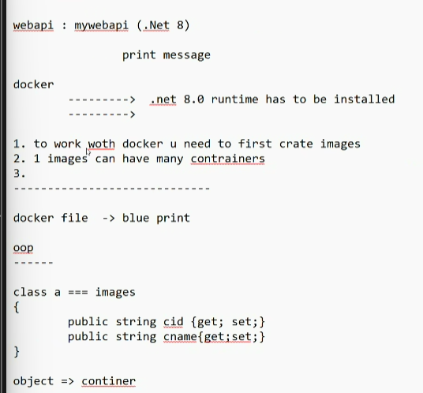
- container is a read and write copy,it will have all the required dependecy but how contianer knows what dependencies are requried i.e what type of dependecies are required which is done by using docker.

## Docker:

- .net 8.0 runtime to be installed
- list of library required
- the port number to be used to run the application
- list of commands to be executed while installing to docker desktop
  based upon the image is created--> image will has all the required dependencies.

### Docker repository

- online storage, where all the images are stored. we make then online to use by any body.

#### Docker Commands

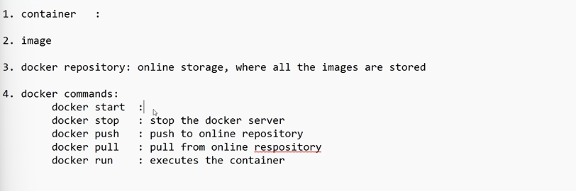

- docker start
- docker stop: rto stop the docker server
- docker push : push to online repository
- docker pull : pull the online repository
- docker run : executes the container

#### Docker desktop:

all the images and the containers are stored locally.

#### steps to create or store an image:

- 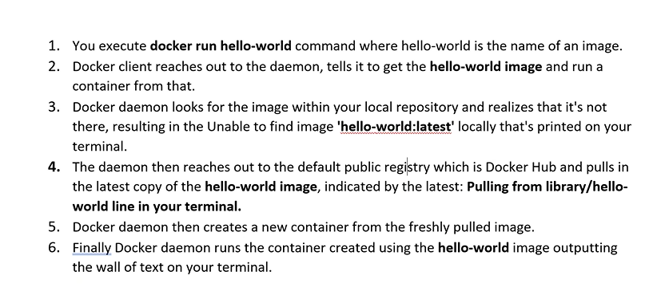

## steps to create our own docker

- create a folder in a drive named "dockerdemo" or any name
- open that folder in vs code
- in the terminal type this command

```c#
 dotnet new webapi -n MyWebApi
```

- will creates a new wepapi project naming MyWebApi.
- type this command cd MyWebApi
- now type dotnet build it will compile the project

```c#
# Use the official ASP.NET Core runtime as a parent image
FROM mcr.microsoft.com/dotnet/aspnet:8.0 AS base
WORKDIR /app
EXPOSE 8080

# Use the official ASP.NET Core SDK image to build the app
FROM mcr.microsoft.com/dotnet/sdk:8.0 AS build
WORKDIR /src
COPY ["MyWebApi.csproj", "MyWebApi/"]// cpoy the project file into the docker
RUN dotnet restore "MyWebApi/MyWebApi.csproj"// if that project uses any librairies then those are also get stored
WORKDIR "/src/MyWebApi"
COPY . .

RUN dotnet build "MyWebApi.csproj" -c Release -o /app/build

FROM build AS publish
RUN dotnet publish "MyWebApi.csproj" -c Release -o /app/publish // publish will creates a docker file

# Use the base image to run the app
FROM base AS final
WORKDIR /app
COPY --from=publish /app/publish .
ENTRYPOINT ["dotnet", "MyWebApi.dll"]
```

- type this command will creates an image

```c#
docker build -t image_name .
// internally it will compile the project
// after compiling the project it will publish the project but it don't give the source code in the docker.in the dll files in the docker.which contains the il code format.
```

- next step is to create a contianer the command is:

```c#
docker -d -p 8080:8080 -n Name_for_container image_name
```

- the last step is to test the contianer there are 2 ways which are given below
  1. type linux command curl url
  2. in chrome

---

- command to send the image to the repository
  docker -tag image_name username/image_name:latest
  docker -push username/image_name:latest

- command to read from the repository
  docker pull username/image_name:latest

# Kubernates

- kubernates is an orchestration platform
- the primary job of the kubernates is to manage and moniter the containers.
- to handle the big number of users we use the kubernates.
- the additonal contianers are created to handles the user requests.
- if users are increased then the containers has to be added but after the requests has been decreased then the containers has to be removed. which is a typical task to create 1000's of containers
- because of this situation the kubernates are used

### What is kubernates?

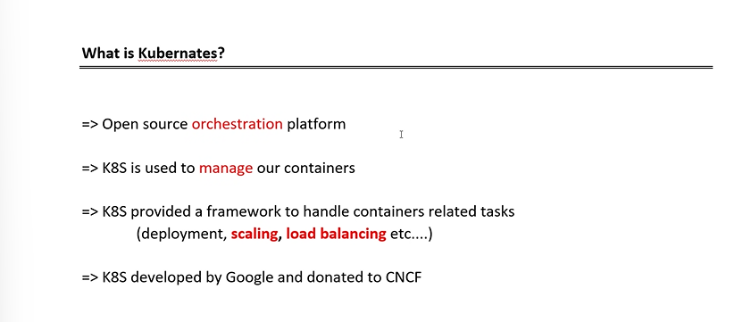

- K8S is used t manage the container
- K_eigthletters_S it is provided a framework to handle contianers

### Advangtages:

- 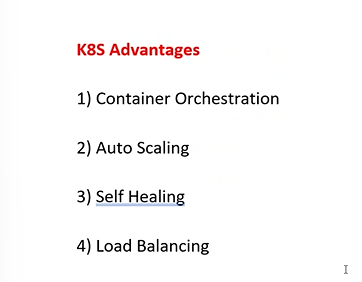

-------------------------------------------\*

- 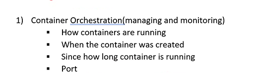

###### the command to use the kubernates or to work with kubernates we use kubectl

--------------------------------------------------\*
this is all the part of the clusters

- group of sys where contianers are created is known as clusters.
- the cluster are made up of one master node and many worker node.

1. master node-manages all the worker nodes

- where it will take care of autoscaling,selfhealing,loadbalancing this all will take care of the master node.
- 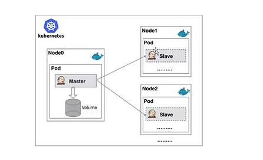

2. worker node
3. pod

- the kubernates will creates the pod not the contianers if we want to create a container we actually need to be create the pot.which stores the contianers.
- one pod can have many contianers.

4. volume

- if the containers are crashed then that data is stored in the volume which is kept at the master.
- 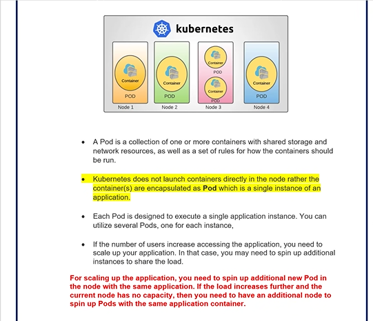
  -------------------------------------\*
- to create or to work with kubernates we use two files

1. Deployment.YAML Files(yet another markup lang)
2. Service.yaml file

3. dev

- how many pods are in use or to be used is there in this file
  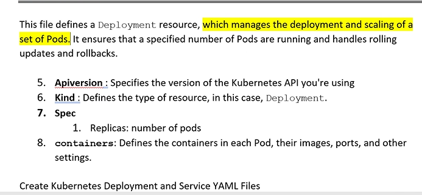
- number of pods are running is said in the SPEC
- which webapi has to be stored in the pods also said in the SPEC
- the name for the contianer is present in the TEMPLATE

2. ser
   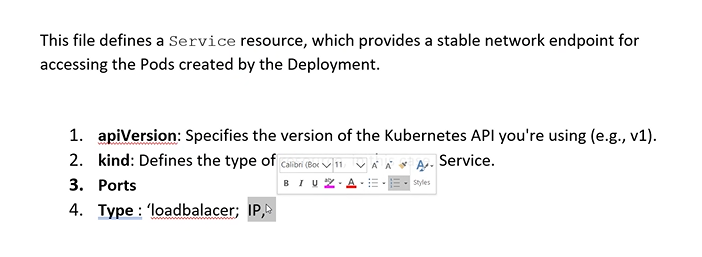
   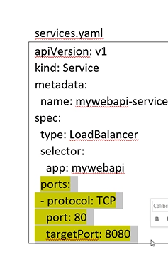

- used for laod balancing
- port numbers

### Step 3:

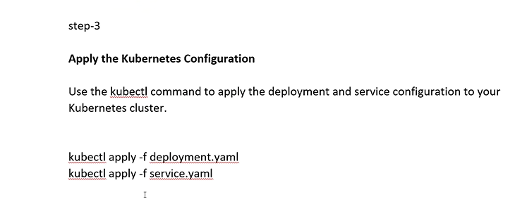

- to deploy these files into the kubernates we do this in this step 3.

### step 4:

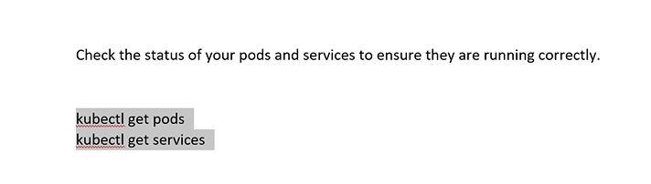

- to moniter the pods we write this commands
- kubectl get pods (used to see number of pods running)
- minikube : is a tool that allows you to create a cluster to run on your local machine. it's primary used for development and testing purpose.ch
  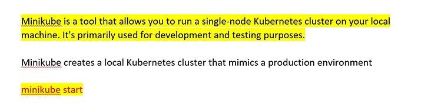
