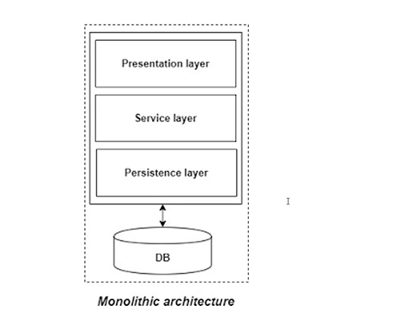
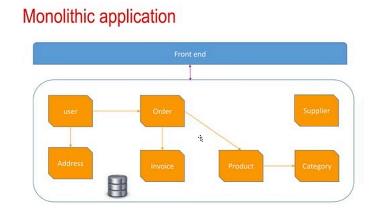
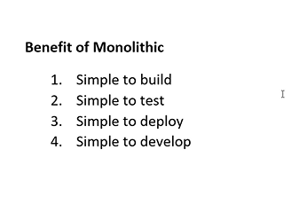
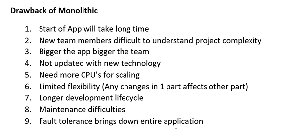
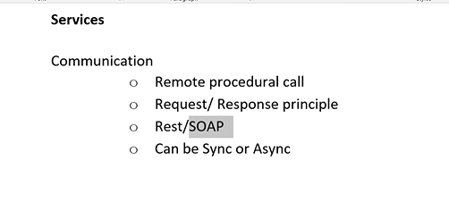
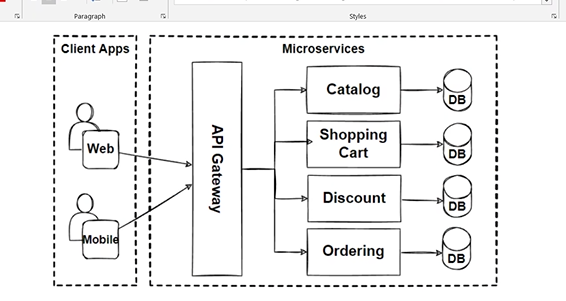
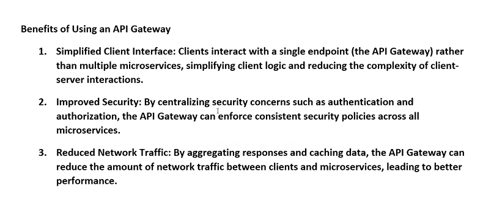
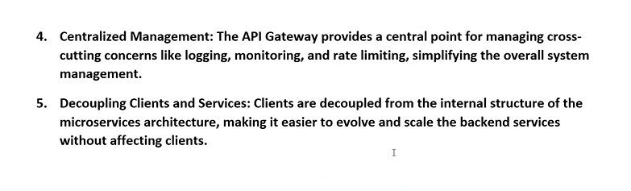

# Microservice Application

## Monolathic Application:

- if we not make the services micro then those project is called monolithic Application
- 
- monolathic has single deployment which means deployement usually happens once
- Single runtime means we use only single language not more than that. one language for one project
- Single Database
- Interaction b/w classes is most often i.e synchronus
- Each layer is seperated with Packages/Libraries
  

### Benifit of Monlathic

### Drawbacks of Monolathic Application

1. the start of app will take long because once we opened an application it will compile the controllers present in the entire project even though we don't need that controller to be used also it will run.
2. understanding is difficult because everthing is stored in a single place.
3. bigger the app bigger the team.
4. Limited flexibility(the changes may affect to the another layer).

---

## Microservices

- the developers has all the plan means the idea of the project by the deployment is happend layer by layer
- they will deploy the project and add the new features layer by layer
- decentralized
- changes won't affect the another controllers or the the layers.
- the things which are independent with each other will be divided.
- we can also use different api's ile rest,soap can be used for any layers.
- 
- Using rabbitMQ two microservcies gets connected.

- the application gateway in the above is a web api which is connected to by all the microservices so that user don't requried more link instead using on gateway.
  
  

1. not required multiple urls only one link which can be used to access any sevices
2. we can place the common things in this gateway means instead of writing authentication in every pages we can write the common logic here.
3. reduces the network traffic by loading only the necessary pages which are required by the particular user.

### Ocelot

- a package used to connect the microservices to the gateway
- which is to be installed in the gateway project
- upstream is used for user by which has the url by which user can use the web page.
- downstream is used to redirect to that page when the user entered the downstream url.
