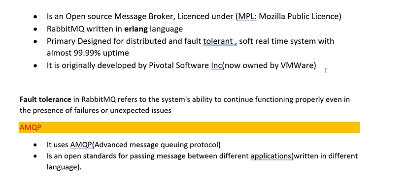
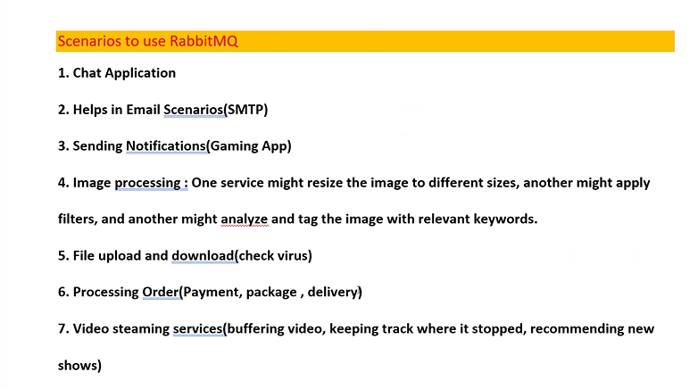
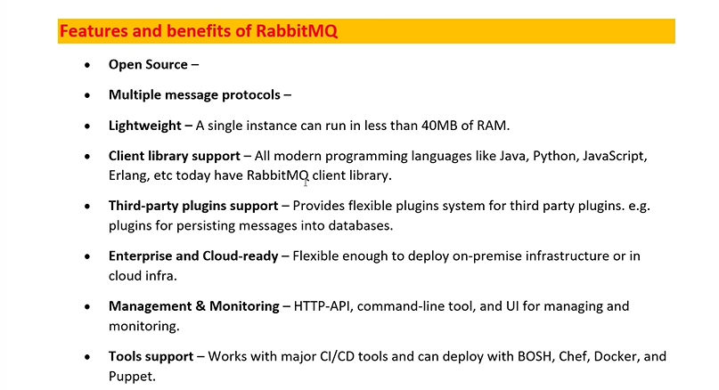
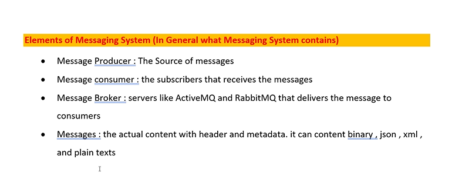
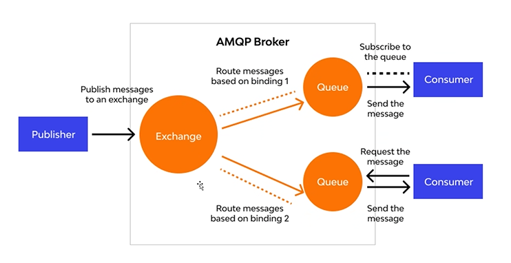
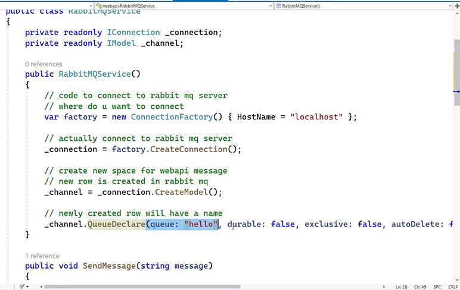

# RabbitMQ(message Queue)

### the primary use of rabbit mq is to avoid fault tolerance.

- 
- 
- to avoid the fault tolerance the rabbitMQ will stores the data in the queue.

### AMPQ(Advanced message queuing protocol)

---





- there are two ways to work with rabbitMQ

1. Manual Method
2. Rebus Method(Automatic)

3. Manual Method:

- install the package rabbitMq.client
- create a class file which is used for how to store the data in the queue.
- import the namespace using rabbitMQ.Client;
  we required two interface theu are iconnection and imodel.
- 

```c#
private readonly IConnection _connection;
    private readonly IModel _channel;

    public RabbitMQService()
    {
        // to connect to the rabbit mq Server
        // where do you wnat to connect
        var factory = new ConnectionFactory() { HostName = "localhost" };
           // for connection creation we write this
        _connection = factory.CreateConnection();
       // true means all connection  and false me connection for each unit
        _channel = _connection.CreateModel();
        // newly created row will be named here
        _channel.QueueDeclare(queue: "hello", durable: false, exclusive: false, autoDelete: false, arguments: null);
    }
 // store the msg in newly created queue
 //the only format the queue store is byte format

    public void SendMessage(string message)
    {
        // we convert the msg to byte here
        var body = Encoding.UTF8.GetBytes(message);
        //store by using basicpublish this line stores the actual msg here
        _channel.BasicPublish(exchange: "", routingKey: "hello", basicProperties: null, body: body);
        Console.WriteLine(" [x] Sent {0}", message);
    }
 // after the work we close the connection here in the destructor.
    ~RabbitMQService()
    {
        _channel.Close();
        _connection.Close();
    }
```

- durable: Whether the queue should survive a broker restart (set to false here).
- exclusive: If true, the queue is used by only one connection and the queue will be deleted when that connection closes (set to false here).
- autoDelete: If true, the queue is deleted when the last consumer unsubscribes (set to false here).
- arguments: Any additional arguments for the queue (set to null here).
