# MVC(Model View Controller)

- it is an architecture pattern. It contains

  1. UI(user interface)
  2. Cs Page(Logic) - to check the logic in ui we write in this page
  3. Model file(class with properties) + Context file(path and connection with the database).

- Model: Represents data
- View : User Interface(.cshtml files)
- Controller : Handles User requests.
- this mvc has only 1 .cs file to store the logic of all the pages in a centeralized way.
- 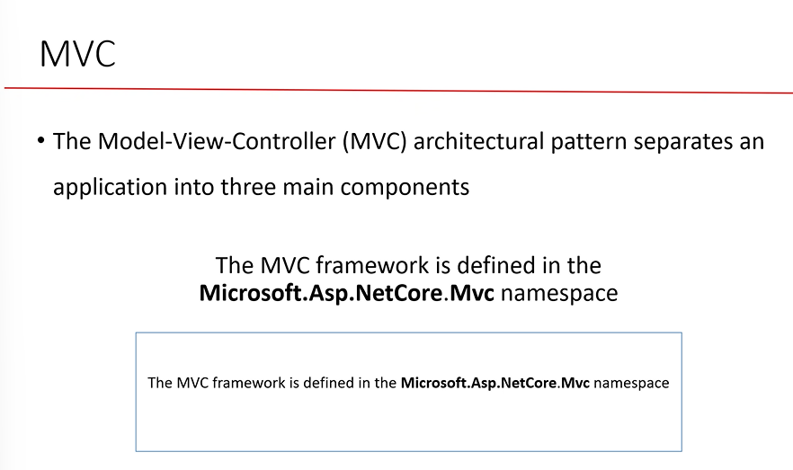
- architecutre is different .
- 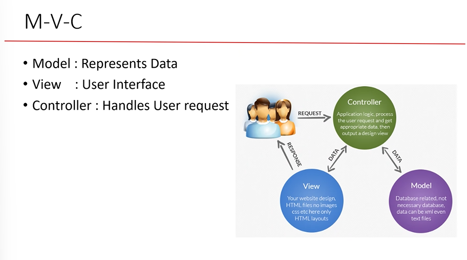
- we cannot call cshtml ,html files directly. we are not using the extensions
- controller stores the logic and also controls the user requests. User can't interact with the ui directly
- the model will sent the data to the controller and stores the data asked by user and pull the data to the view and sent to the user.
- 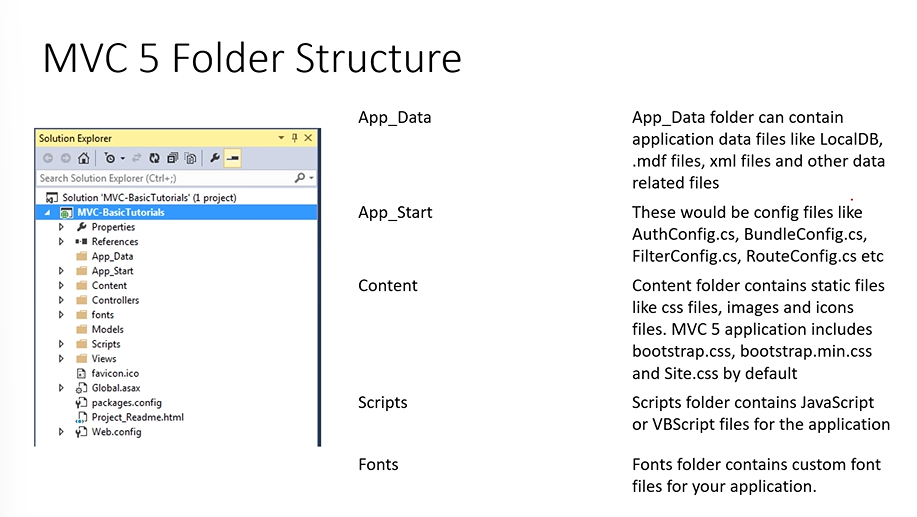

1. all temeroary data is store in app_data folder
2. app_start will contains the authentication configs.
3. content will stores the static files i.e html files
4. scripts - stores the js files
5. fonts - will stores the font styles.
   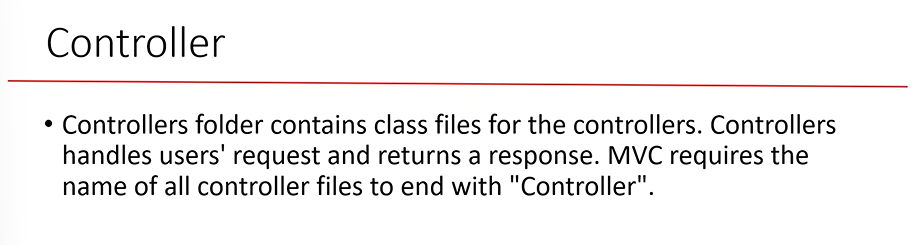

- the controller files should be ends with conrtoller name.
  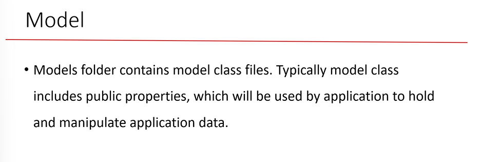

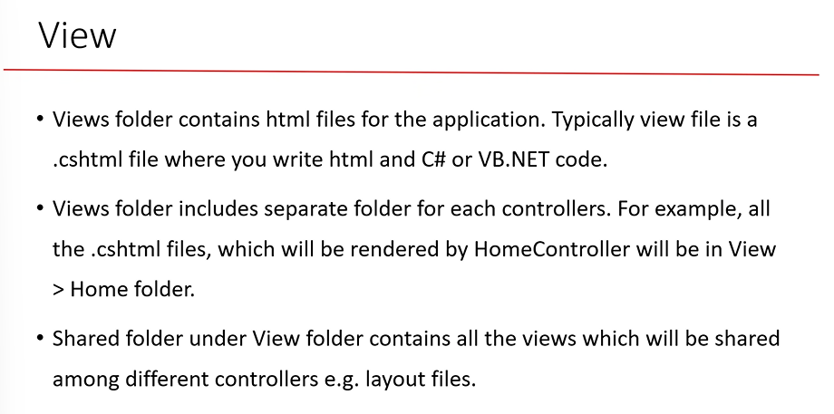

- view imports file can store the namespaces used for the project instead of inporting in every page we can write only once in here and can be used in all the pages.
- viewstart.cshtml will contains the layouts
- to call the page write : 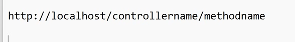
- we can return the string by applying the fonts i.e html tags using ContentResult type as given below
- 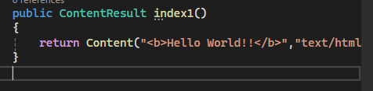

```html
<a asp-controller="Home" asp-action="index1">index1</a>

<a asp-controller="Home" asp-action="showdate">showdate</a>
```

- to open that page we use this type of link.
- 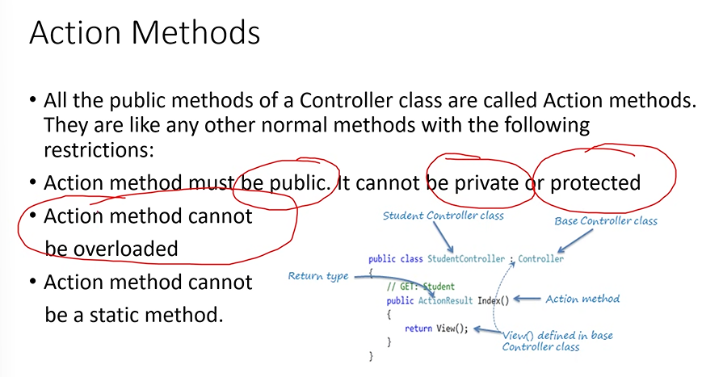
- internally the method is called using objects so it should not be mentioned as static or even private
- 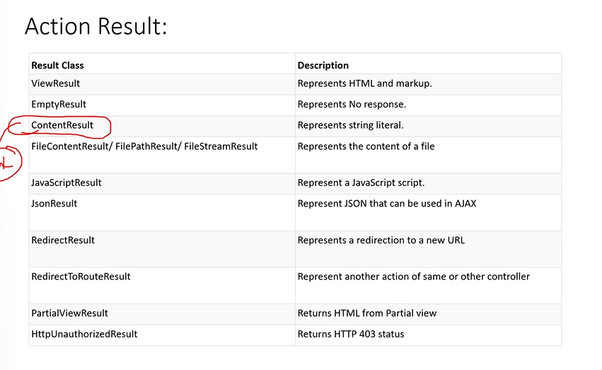

## Passing the data from controller to view

- 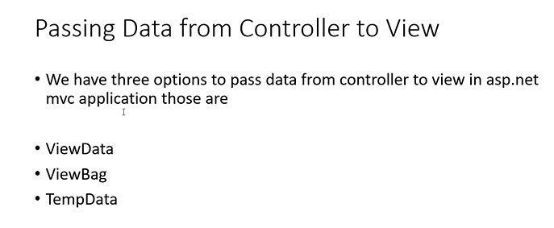
- viewdata : 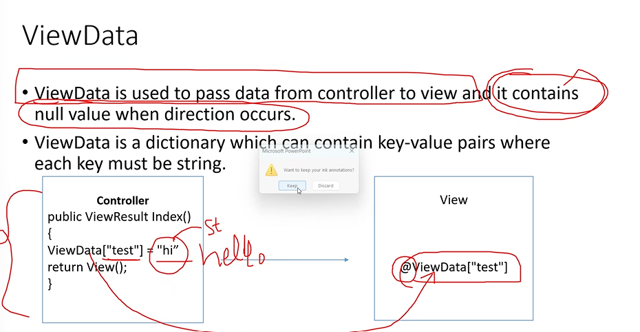
- it is a dictinoary type method which has keys and value
- we cannot pass the data of from one method to another method simply it pass null value when redirection occurs.
- any data assigined to the viewdata then it is object.
- conversion is required
- view bag : 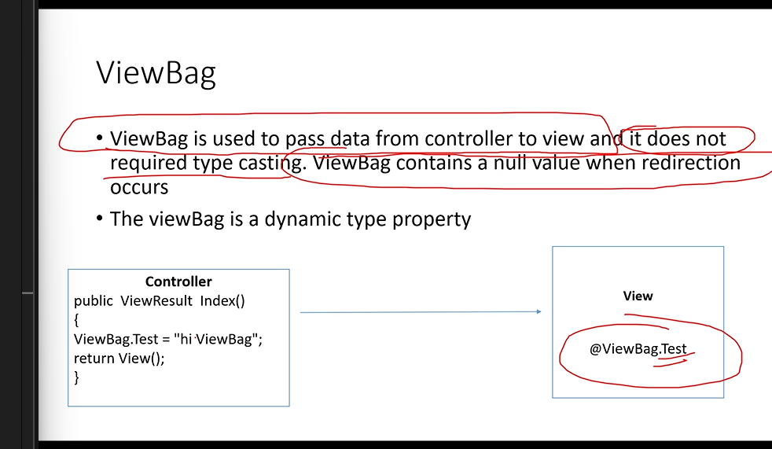
- it is a dynamic property because it won't change the datatype while assinging so that conversion is not required.
- Temp Data: 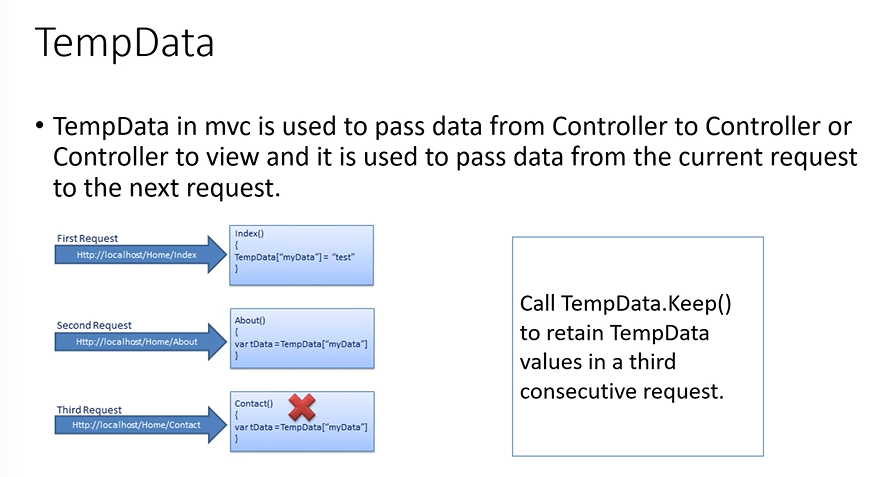
- there is no null here we can use it any method or in any controllers
- tempdata.keep() will keeps the data as it is means it will pass the data as it is not null like in remaining cases.
- but the drawback is from 1 to 2 it will works but from 2 to 3 it will not work beccause it makes the val null from 2 to 3.
- pass the parameter as well.

## Action Selector

- 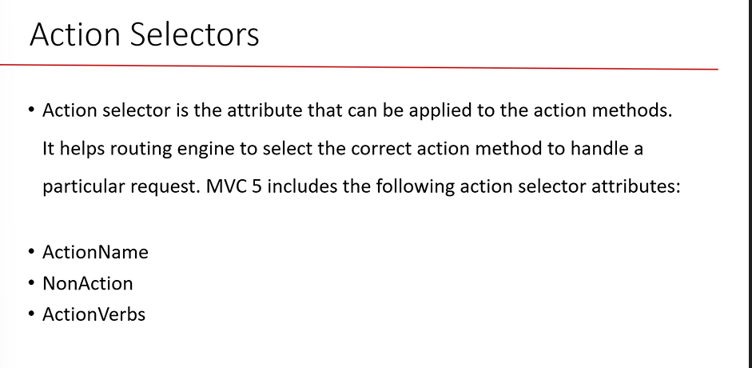
- Action Name:used to create an ailas name for the mehthod.

```c#
[ActionName("ind")]
public string india()
{
    return "welcome to india";
}// here india will not work
```

- but we cannot use it for view typed methods
  - renaming the file.
  - return View("showdate");

## NO Action

- 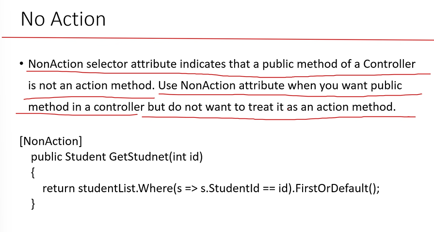
- if there are some methods which we don't want to show the method in the browser we can mention no action attribute there.

## Action Verbs

- 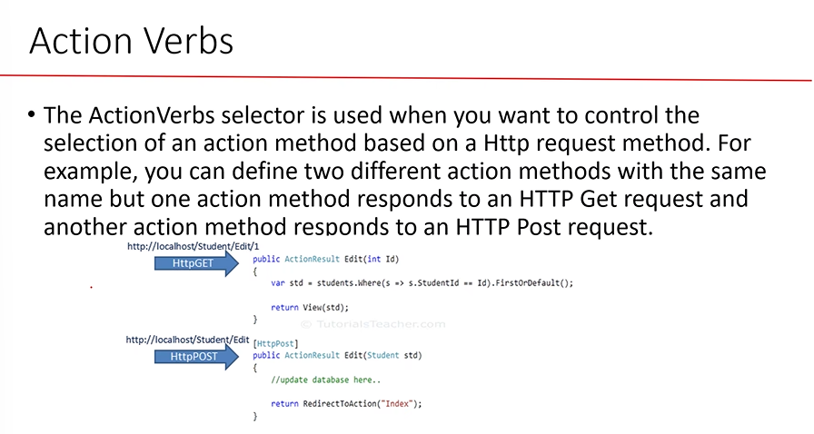
- to use the get,post methods like in razers we should use this attribute.

```c#
public IActionResult Home()
{   // there might be condition like if cond is true then return view or if fails then returns javascript
    //Iaction Result is meant to return any kind if we don't have clarity on what it returns.
    return View();
}
```

### Renderbody()

- render body is a place to display the content
- render body decides where to place the content
  so it should be always placed at center.

- validations can be appiled using [required] key word
- we can also create the custom classes by created a class

```c#
using System.ComponentModel.DataAnnotations;

namespace Online_shoping
{
    public class check_dob: ValidationAttribute
    //validation attribute is used to create our own custom validations.
    {
        public override bool IsValid(object? value)
        {
            DateTime dt = (DateTime)value;
            if (dt < DateTime.Now) return true;
            else
                return false;

        }

    }
}
```

## Session

- if we write something in this session method then we can access that data in entire web page.
  which is better than viewdata and view bag
- it is used for checking the pages like if the login is successful the name is printed and that user can go to that page.
- it will also helps to block certain pages.
- we cannot use seesion variable it is blocked we need to use :

```c#
builder.services.AddSessions();
//should be used any where before build
```

### Partial View

- it is also called as reusable views.
- we can create a UI and we can reuse across multiple pages.
- we can write a code and can be used any pages without duplications
- we can use this partial view inside a complete view.
  </partial name="partial_view_name"/>

- we can use the prartial view from the another project using the href and link of that projects

## Action Filter

- logic which appiled before or after calling action methods.

1. outputcache

- output cache is used to run the page faster i.e instead to execute the method again and again we can make this cache method so that it won't execute that 100 lines of code again and again
  instead it will run the method present int the cache memory.
- decreases the execution time
- we can specify the time and based in that time it will store in cache memory like for this much amount of time it will display the method from the cache memory
- we use builder.Services.AddOutputCache(); to use this attributes.
- drawback is it will store the method so it takes the space and a good configured system is required.

2. Exception Filter:

- USing this flter we can dispaly custom view page when runtime error is encountered.
- it will helps to manage the projects if there are multiple methods.
- to use exception you need to firt create a class
  

3. Authentication

- dotnet supports many kind of authentications

1.  cookie based authentication

- in cookie based authentication we use collection claims and identites
- we also use cookie files(textfiles) in this type.

2.  JWT Authentication

- (json web token) this tupe if application is widely used in web API

3.  OAuth Authentication

- we use external website to get user information
  instead of managing users manually.
- it is similar to login usigng google account
- we use the external websites to get the user data

---

### Cookie Based authentication

- we need to know three things(Keywords) those are

1. claims

- to get the inforamtion regarding particular object/person
- claim always comes in key value based.

2. claims identity

- 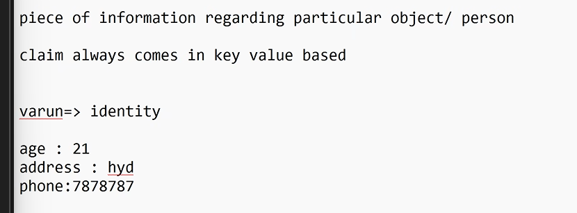
- identity will has multiple claims
- it conatins one or more claims.

3. Claim principle

- contains 1 or more indentites.
- collection of identity

## Corosel

- used to move the images automatically like in amazon app the images will move
