# .NET

- It is a network enabling technologies.
- .net is a platform not a coding language.
- It is a microsoft platform for software applications.
  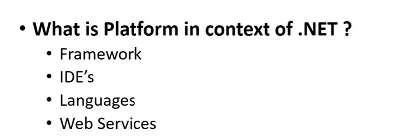

## Frame Work

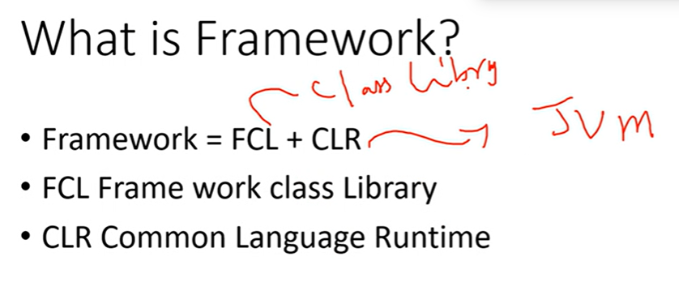

- framework should has a libraries and a jvm i.e to run a program.
- FCL's are nothing but methods i.e inbuilt methods used for our development.
- In dotnet we save the files as dll.-dynamic link library
- or also in exe files(executable).
- global assembly cache(GAC) similar to (c:\windows\assembly)
- assembly means the name given for .exe and .dll files.
- CLR :(Common Language Runtime)
  - it provides a runtime enivronment for .Net
  - to run an application clr -s requried.
    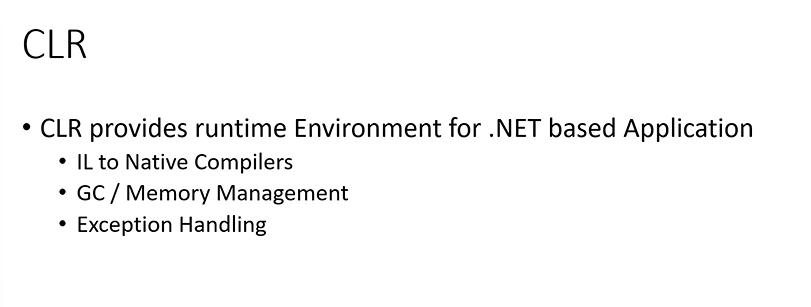
  - to save the program files the extension is .cs
  - for compile the c# files use csc
  - after compilation it creates a file and stores the file as .exe file.
  - MSIL (Microsoft intermideate langugae) it stores the code in msil format which is not understandable for humans and not by systems also.
  - after the msil file is generated then that file again should be converted into another format i.e binary file to needs to be understand by the system inorder to execute that file.
  - so to convert the msil coded to binary format the CLR is used.
    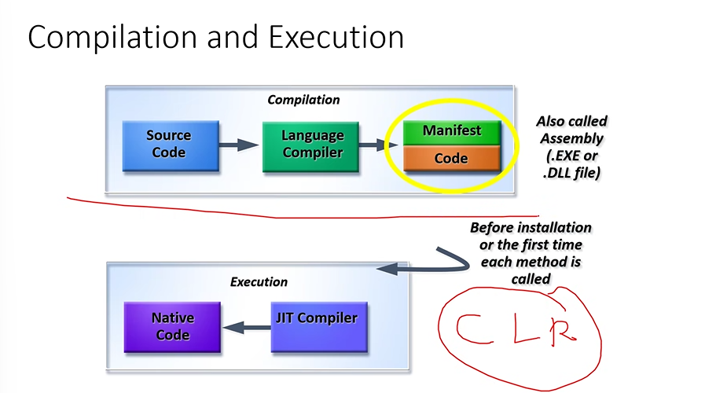
  - allocating and deallocation will also managed by these CLR.
  - space was alsotabken care of CLR.
  - It is also used to handle exceptions(by showing the appropirate error message)
    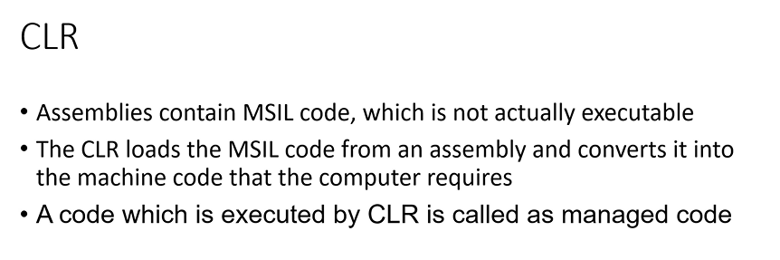

## .net languages

- 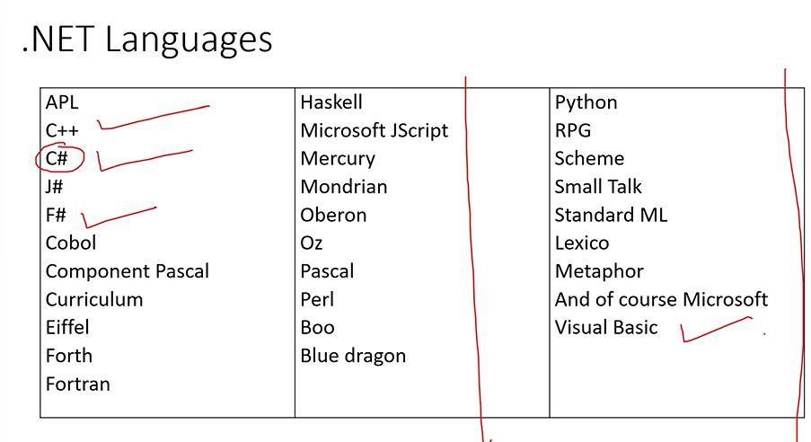
- 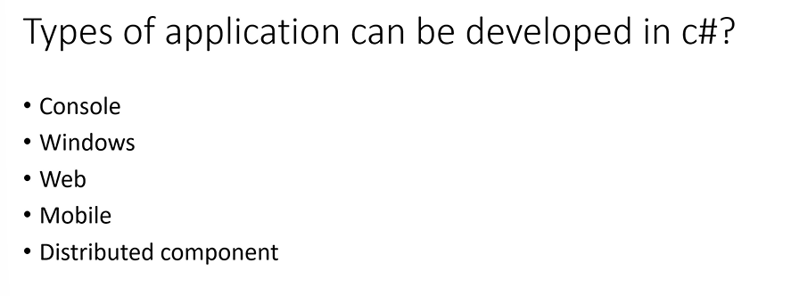

## Data Types

- 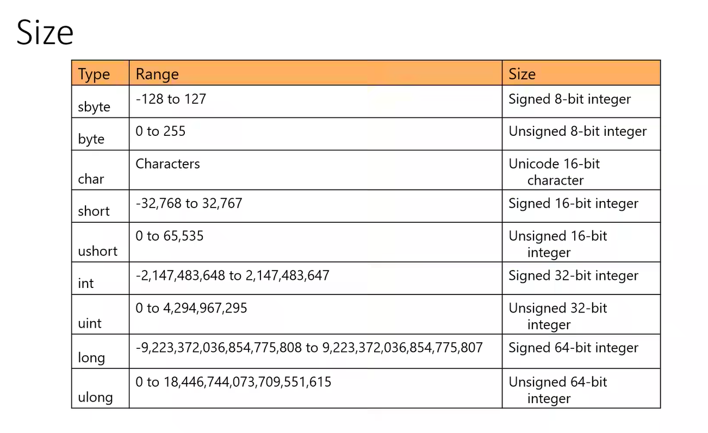
- 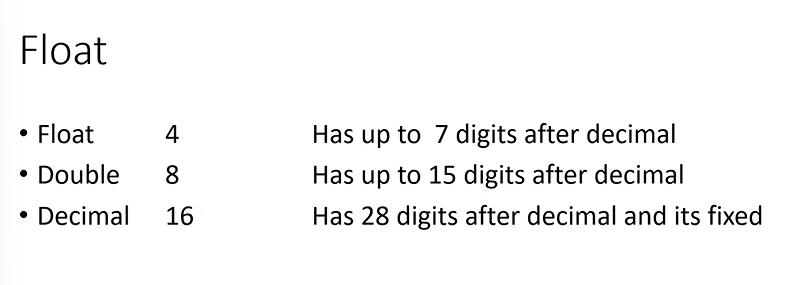
- 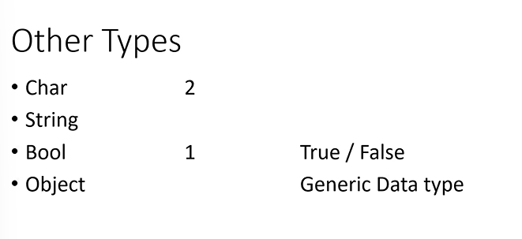
- char will take only single character.
- string and objects don't have size limit.
- strings can store on group of characters
- Object can has custom datatype.

## variable scope(Scope)

- 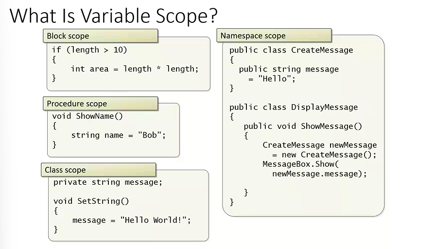
- block scope : can be accesible within the block{}
- procedure Scope : within the function.
- class scope : can be accessible anywhere of the class.

```c#
static void Main(string[] args)
{

    int x = int.Parse(Console.ReadLine());
    int y=int.Parse(Console.ReadLine());
    Console.WriteLine("sum of " + x + " and " + y + " is: " + (x + y));//method 1
Console.WriteLine("sum of {1} and {2} is: {3}" ,x, y,(x+y));//2-method
Console.WriteLine($"sum of {x} and {y} is: {x+y}");//3-method (interpolation)
    Console.Read();
        }


```

- ildasm:TO check for the file whether it is msil file or not.
- to make summary of a method mention /// - this symbol so that it will give the summaray of the method.
- just in time(jit)

```c#
public static void method_name()
{

}
```

- c# has five access specifiers
  1.  public
  2.  private(default)
  3.  protected
  4.  internal -with in the project
  5.  protected internal-
- static : static is mention because to call a method by class name . If static is not mentioned then the method is called via object
- Void : it means return type i.e the method will not return value.
- optional parameter.
- named parameter.
- a method which can return multiple values we use out

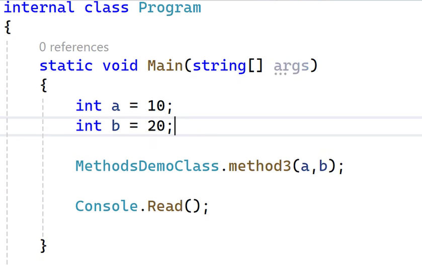
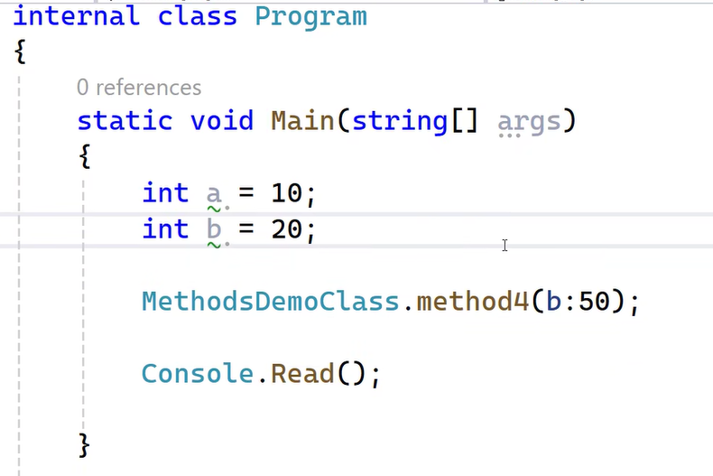

## day-2

## Arrays

- 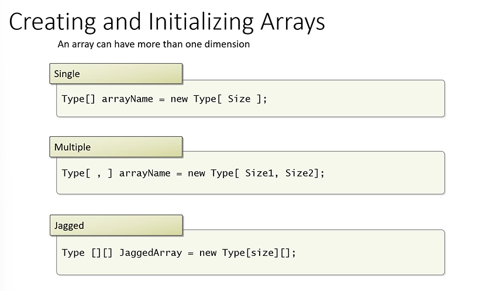

1. single dimension - an array which can hold one value at a time.

```c#
int [] a;
int [] a={10,20,30};
console.writeline(a[0]);
foreach(int i in a)//read only loop,don't require index,
for(int i=0;i<4;i++)//read and write loop ,it works with indexes
array_name.rank//will prints the integer value which says what type of array it is whether it is single or multidimension.
int [] a=new int[3]//to dynamically allocate the space.
a[i]=int.parse(Console.readline());
```

2. multi dimension - an array which can hold more than one value at a time.

```c#
int [,] a=
{
  {10,50,60},
  {50,4,3},
  {1,2,3}
};
a.getlength(0)//prints the length of coloum
a.getlength(1)//prints the length of row
for(int i=0;i<a.getlength(0);i++)
{
  for(int i=0;i<a.getlength(1);i++)
  {
    console.writeLine(a[i,j])
  }
}
```

3. jagged array - it is a type of multi dimension array but the difference is row is fixed but coloumns are not fixed.

```c#
int[][] a= new int[5][];
a[0]=new int[2]{10,20};
a[1]= new int[5]{10,20,2,3,3};
a[2]= new int[1]{2};
foreach(var item in a)
{
  foreach(var i in item)
  {
    console.writeline(i);
  }
}

```

# OOP's

## classes and objects

### objects

- An object has properties(attributes) and functions(methods).
- any thing deals with data then those are called properties.
- simply variables are called as properties.
- actions means it will ask for user to choose those are called actions i.e functions.
- we use new keyword while object creation because the class don't have any size so it takes new and gets the space for that class

```c#
class_name obj_name=new class_name();
```

### class

- never hardcore the data in classes it should get dynamically.

### note : don't place static keyword for methods while calling then with the objects

## Types of classes

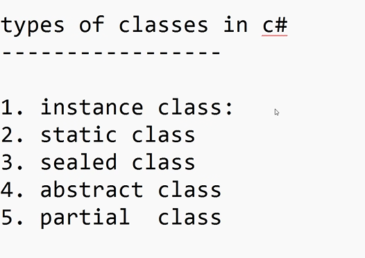

1. instance Class -(default type) any class supports object creation is know as instance class.
   Ex:
   similar to the normal classes.
2. Static class : this type of class can only contain static members only.In this classes we cannot call the class using objects. and we can call only members by using classnames.
3. sealed class : This type of class cannot be inherited,(object creation is possible).
4. abstract class : we cannot create object for an abstarct class but inheritance is allowed.
5. Partial Class : This will allow to share the class members in more than one file.

```c#
static class mystaticlass
{
  public static void function_name()
  {
       //code
       // static classes can store only static methods and variables only.
  }
}
```

```c#
sealed class A
{
  public void hello()
  {
    //code
    // we cannot perform inheritance if we sealed a class.
  }
}
class B :A//error cannot inherit A
```

```C#
abstract class Abs
{

}
class n:Abs
{
  //can get inherited
}
```

```c#
internal class abc
{
  methods
}
internal partial class abc
{
  //some methods from first abc class and remove that methods from there in order to reduce the complexity of the code.(i,e the visibilty complexity)
}
```

## rules to keep on datatypes

```c#
public demo_class
{

int a;
public int age
{
  set
  {
    a=value;
    if(value>100)
    Console.writeline("invalid");
  }
  get
  {
    return a;
  }
}
}
class main
{
  static void main(string[]args)
  {
    demo_class obj = new demo_class();
    obj.age=10;
    console.writeline(age);
  }
}
```

- for automatic properties use

```c#
  internal class employee
{
    public string firstname { get; set; }
    public string lastname { get; set; }
    public float salary { get; set; }
    public void fullname()
    {
        Console.WriteLine(firstname + " " + lastname);
    }
    public void annual_salary()
    {
        Console.WriteLine(salary * 12);
    }


}
class main
{
 static void main()
 {
   employee obj5 = new employee();
obj5.firstname = "sumanth";
obj5.lastname = "bachu";
obj5.salary = 100000;
obj5.fullname();
obj5.annual_salary();
 }
}
```

## Constructors

- Types of constructor:
- instance :- when ever the object is called this type of constructor will be called every time.
- static :- this type of construtor will called only one time even though the object is created multiple time. and this is used to connect to the database.
- if we inherit the constructors from the base class then we need to inherit for the constructor to.

```c#
 public dervied(int y) : base(y)
```

# Day-4

## Encapsulation

- advantage of this is security.
- we can acheive encapusation by dumping the variables and methods in a single class.

## Inheritance

- used for code reusability.
- the class which uses features is called as derived class.
- the class which provides the features is called as base class.
- c# will only supports only single inheritance.

```c#
A
{
  show(){}
}
B:A
{
  display(){}
}
B ob = new B();
ob.show();
ob.display();
```

```c#
namespace first_project
{
    abstract class common
    {
        public String firstname { get; set; }
        public string lastname { get; set; }
        public void fullname()
        {
            Console.WriteLine(firstname + " " + lastname);
        }
        internal class partimeemployee : common
        {


            public byte totalhrs_worked { get; set; }
            public int rate_per_hour { get; set; }
            public string dept { get; set; }
            public void fullname()
            {
                Console.WriteLine("full  name is :"+firstname + " " + lastname);
            }
            public void caluclate_total_sal()
            {
                fullname();
                base.fullname();
                Console.WriteLine(totalhrs_worked * rate_per_hour);
            }
            internal class employee : common
            {

                public float salary { get; set; }
                public void fullname()
                {
                    Console.WriteLine(firstname + " " + lastname);
                }
                public void annual_salary()
                {
                    Console.WriteLine(salary * 12);
                }


            }
        }


    }
}
```

- 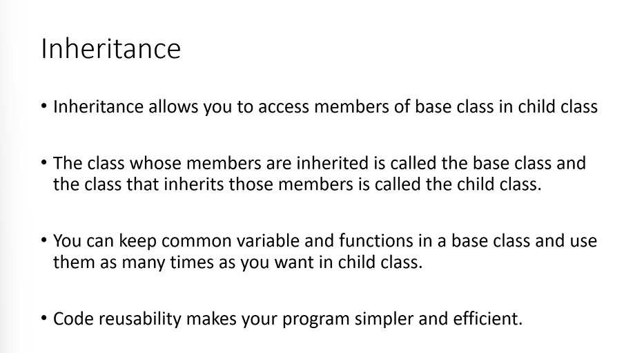

## PolyMorpishm(many forms)

- two types :
  - static / compile time polymorpisam(overloading)
  - dynamic /runtime polymorsisam(overridding)

## static polymorphism

## dynamic polymorphism

- Note : Minimum two classes are required for the dynamic polymorphism.

1. it should has same method name and same parameters as well.
2. in the base we should use the virtual keyword.

- placing virtual means this method is not permanent.Can be changable.

3. in the derived class override keyword must and should use.

- to acheive the dynamic polymorphism inheritance must be used.

### Note : using the dynamic polymorshism we can create an base class object and can call the derived class methods.

- 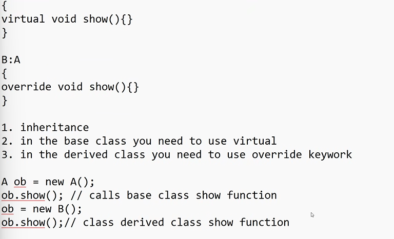
- 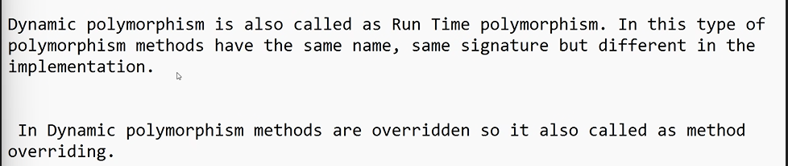

```c#
internal class basecls
{
     public virtual  void show()
     {
         Console.WriteLine("base class called");
     }
}

internal class derivedcls:basecls
{
     public override void show()
     {
         Console.WriteLine("derived class called");
     }
}
  basecls ob = new basecls();
  ob.show();
  ob = new derivedcls();
  ob.show();
```

## Abstraction

-

### note : shadowing key words are used when we don't want to override a method for this we use new key word (public new void Method_name(){})- reverse of override method.

## Interface

- pure abstraction.
- we can't intialize the varaibles and methods.
- use interface keyword to create an interface.
- advantages :
  - 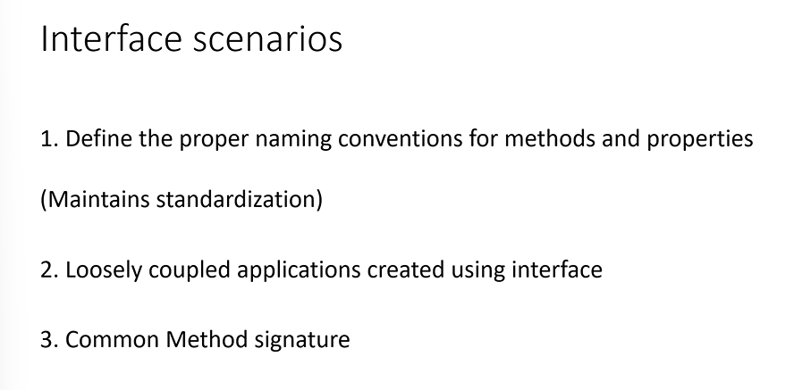

1. It will force the class to use the method signature defined in the interface.
2. loosly coupled applications created using interface : you can dislay the required method for the user.

```c#
namespace first_project
{

interface Imathinter

    {
        void add(int x, int y);
        void sub(int x, int y);
    }

    interface Idbinter
    {
        void readfromdatabase();
        void storeindatabase();
    }

    internal class day_4_interfaces : Imathinter, Idbinter
    {
        public void add(int x, int y){}

        public void sub(int x, int y) { }
        public void readfromdatabase()
        {
            Console.WriteLine("read method called");
        }

        public void storeindatabase()
        {
            Console.WriteLine("store method called");
        }
    }
}
```

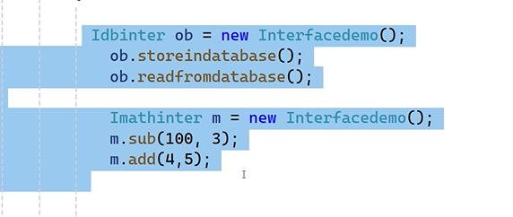

3. common method signature : -u can have 3 methods with same signature having different implemntaiton in a single class.

```c#
interface Ione
{
     void Add(int x, int y);
}

interface Itwo
{
     void Add(int x, int y);
}

internal class InterDemo:Ione, Itwo
{
      void Ione.Add(int x, int y)
     {
         Console.WriteLine(x + y);
     }
      void Itwo.Add(int x, int y)
     {
         Console.WriteLine("the sum is " + (x + y));
     }
}

  Ione ob = new InterDemo();
  ob.Add(10, 10);

  Itwo ob1 = new InterDemo();
  ob1.Add(10, 10);
```

## Delegate

- we cannot write any logic i.e it does not support the logic
- if we want to create a funciton without logic then use delegate keyword.

```c#
public delegate void show();
```

- it will point to any other method having same signature.
- delegate method will points the same method with similar method i.e same signatures.
  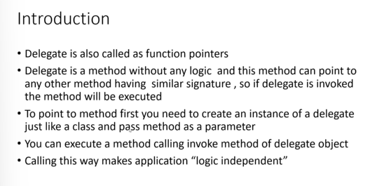
- how to point?

```c#
delegate_func_name obj_name = method_name
// delagate method can supports the object creation
//but it should point to same method
//to call that method
obj_name.invoke();
//1.create a delegate
//2.point the method(same) or instantiation
//3.invokation
```

```c#
//method 2
obj=delegate(int m) {Console.WriteLine("even");};
```

```c#
//method 3(lamda expression)parameter =>logic
obj =(m)=>{Console.WriteLine("even");}
```

```c#
 internal class DelegateDemo
 {
     // declaration
     public delegate void mydelegate(int x);

     //public void Even(int x)
     //{
     //    Console.WriteLine("Even number " + x);
     //}
     public void Odd(int x)
     {
         Console.WriteLine("Odd number" + x);
     }
     public void show(int x)
     {
         mydelegate obj;
         if (x % 2 == 0)
         {
             // obj = Even;// instantiation
             //  obj = delegate (int m) { Console.WriteLine("Even number " + m); };
             obj = (m) => { Console.WriteLine("Even number " + m); };
         }
         else
         {
             obj = Odd;// instantiation
         }
         obj.Invoke(x); // invocation

     }

 }
  DelegateDemo del = new DelegateDemo();
 del.show(10);
```

```c#

namespace first_project
{
    public delegate void mydel();
    class mydelcls
    {

        public void show1(mydel m)
        {


            m.Invoke();
        }


    }
}
  mydelcls dela = new mydelcls();
   mydel su;
 su = () => { Console.WriteLine("10"); };
dela.show1(su);

 //Console.Read();
 Console.Read();
```

```c#
 internal class deldemo
 {
     public delegate void testdel(int empid, string empaname);
     public void showempdata(int empid, string empname)
     {
         Console.WriteLine(empid);
         Console.WriteLine(empname);
     }

     public void show(int empid, string empname)
     {
         testdel ob = showempdata;
         ob.Invoke(empid, empname);


     }

 }
  deldemo demo = new deldemo();
 demo.show(100, "sumanth");
```

- logic is independent.
- logic as a parameters we use delegates.

# Day-5

## Generics

- It is a collection of related elements or objects.
- to overcome the drawbacks of array we use generics.
- generics can also used to store the data.
- the advanatges of generics are disadvantages of arrays.
- library for genreics is " System.collection.generics.
  1. list class
  2. dictonary
  3. sortedlist
  4. stack
  5. queues
  6. custom classes /methods

## Draw Backs of array's

1.  Size i.e the size is fixed
2.  Dynamically insertion and deletion is not possible.
    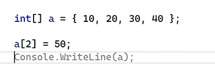
3.  Does not support sorting and filtering
4.  Does not support LIFO and FIFO.

## List

```c#
List<Datatype> variable = new List<datatype>();
ob.add()// to add value relpace it with {values};
ob.Count // will prints the length.
foreach(var i in ob)
{
  Console.WriteLine(i);
}
ob.Sort();//will sort the list ASEC
ob.Reverse();//will sort list by DESC
ob.Insert(position,values);
ob.Remove(value);// removes only one value
ob.RemoveAll(x=> x==500);//removes all the elements equal to 500
ob.RemoveAt(3);// postion 3
ob.RemoveRange(2,5);//locations
ob.Capacity;// will prints the actual size for a  list based on the data type
li.TrimExcess(); // to remove the excess size.
```

```c#
internal class day_5_list
{
    public void demo()
    {
        List<String> str = new List<String>()
        { "srilanka","Sinagapore","malegalaya","india","goa"};

        foreach (var i in str)
        {
            if (i.StartsWith("s"))
            {
                Console.WriteLine(i);
            }
        }
    }
}
```

```c#
public void Demo4()
{
    // how to store product  details
    // pid pname price qty
    List<Products> li = new List<Products>();

    // Method-1
    Products p1 = new Products();
    p1.pid = 100;
    p1.pname = "shoes";
    p1.price = 3000;
    p1.qty = 2;


    Products p2 = new Products();
    p2.pid = 200;
    p2.pname = "Shirt";
    p2.price = 500;
    p2.qty = 5;


    li.Add(p1);
    li.Add(p2);

    // Method-2
    Products p3 = new Products() { pid = 300, pname = "monitor", price = 5000, qty = 8 };
    li.Add(p3);

    //Method-3

    li.Add(new Products() { pid = 400, pname = "cd", price = 120, qty = 2 });


    foreach (var item in li)
    {
        Console.WriteLine(item.pid + ":" + item.pname + ":" + item.price + ":" + item.qty);
    }

}
```

```c#
List<Products> li = new List<Products>()
  {//this feature is called colletion intilaizer
      new Products(){ pid=100, pname="cd1", price=120, qty=4 },
       new Products(){ pid=200, pname="cd2", price=220, qty=4 },
        new Products(){ pid=300, pname="cd3", price=320, qty=4 },
         new Products(){ pid=400, pname="cd4", price=420, qty=4 },
  };


//  Products item = li[0];
// Console.WriteLine(item.pid + ":" + item.pname + ":" + item.price + ":" + item.qty);

  foreach (var item in li)
  {
      Console.WriteLine(item.pid + ":" + item.pname + ":" + item.price + ":" + item.qty);
  }
```

## Dictonary

- items are accessed using key instead of index position
- dictonary takes two datatypes.(keys,values)
- sortedlist is used to sort the dict.

```c#
SortedList <int,string> s= new SortedList<int,string>(d);
```

```c#
  public void demo5()
{

     Dictionary<int, string> d = new Dictionary<int, string>();

     d.Add(100, "india");
     d.Add(200, "canada");
     d.Add(300, "swiz");
     d.Add(400, "uk");
     d.Add(250, "us");
     d.Add(105, "japan");

     Console.WriteLine(d[200]);// prints canada
     SortedList<int, string> s = new SortedList<int, string>(d);
     foreach (var item in s)
     {
         Console.WriteLine(item.Key + ":" + item.Value);
     }

}
```

## Stacks

- follows LIFO i.e items are arranged in last in first out.
- ex:
  - browser histroy
  - orders
  - youtube comments

```c#
Stack<string> s = new stack<String>();
s.push("hi");
s.push("hello");
s.push("Sumanth");
foreach(var i in s)
Console.Write(item);
Console.Write(s.Count);
Console.WriteLine(s.pop());//prints and remove
Console.Write(s.peek());//prints the value but not removes the value
```

## Queue

- FIFO

```c#
Queue<string> s = new <string>();
s.Enqueue("sumanth");
s.Enqueue("hi");
s.Enqueue("hello");
Console.WriteLine(s.Count);
Console.WriteLine(s.peek());//prints the first element
Console.WriteLine(s.Dequeue());//removes the first element and prints the deleted and altered queue
foreach(var i in s)
Console.WriteLine(i);//prints the items.
```

## Custom Class

- we can create a custom datatype and can pass that type by metioning it in angular brackets.

```c#
public void swap<T>(T a, T b)
  {

      T c = a;
      a = b;
      b = c;
      Console.WriteLine(a);
      Console.WriteLine(b);
  }
  swap<int>(10,20);
  swap<string>("hi","hell");
```

- it can also possible for the class

```c#
class demo<t>{}
demo<t> obj = new demo<t>();
```

## Exception Handling

- TO solve the runtime errors
- we use try,catch,throw,finally keywords are used to handle the exeception
- Inorder t save the program from crashing we use the exception handling.
- One try can has many catches.
- To handle multiple exceptions we use Exception

```c#
try
{

    int a = int.Parse(Console.ReadLine());
    int b = int.Parse(Console.ReadLine());
    int c = a / b;
    Console.WriteLine(c);
}

catch(DivideByZeroException e) {
    Console.WriteLine(e.Message);
}
catch(Exception e)
{

    Console.WriteLine(e.Message);
}
```

- finally is a block will executes every time even if the program is correct or wrong it will executes the finally block code.
- Write a logic to clear the resources.
- close the database connection
- close the opend file
- or to save the file we use this finally block to alert the user it is kind of altering the user.
- checked keyword- used to check for the datatype

```c#
checked {
  byte b = 255;
  int c = ++b +10;
  Console.Write(c);
}
```

## Custom Eceptions

- like age is greater than the 19
- DOB should be not future.

```c#
class AgeException:ApplicationException

{

public AgeException(string message) : base(message)

    { }

}

-----------------------------
public void display()

{

     try

     {

         int i = int.Parse(Console.ReadLine());

         if (i < 18)

             throw new AgeException("Min Age should be 18");

     }

     catch (AgeException ex)

     {

         Console.WriteLine(ex.Message);

     }

}
 day_5_demoforcustomeceptiom d55 = new day_5_demoforcustomeceptiom();
  d55.display();

```

## Streams(File Handling)

- to create files
- Logging error
- Serialization
- to Store Offline copy data.

### how to create a file

- use file stream class
  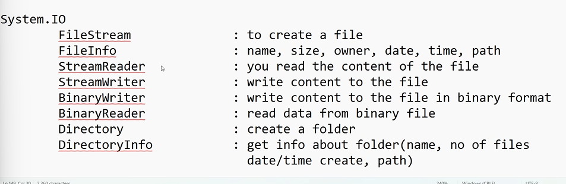

```c#
FileStream fs = new FileStream("path",filemode.mode_name,FileAccess.read,write);
StreamWriter sw = new StreamWriter(fs);
sw.WriteLine("hi");
sw.Close();
fs.Dispose();
Console.WriteLine("File Created Successfully");
```

```c#
public void Demo1()
{
    // how to create
    FileStream fs = new FileStream("E:\\proclink\\hello.txt", FileMode.OpenOrCreate, FileAccess.ReadWrite);


    // store data in a file

    StreamWriter sw = new StreamWriter(fs);
    sw.WriteLine("hello students");
    sw.WriteLine("lets learn file handling");

    sw.Close();
    fs.Dispose();
    Console.WriteLine("File create successfully");

}
pubic void demo2()
{
  StreamReader sr = new StreamReader(fs);
   string str=sr.ReadToEnd();
     Console.WriteLine(str);
     sr.Close();
     fs.Dispose();
     Console.WriteLine("File opened successfully");
}
public void Demo3()
{

    // how to create folder
    Directory.CreateDirectory("E:\\proclink\\mydir");
    Console.WriteLine("created successfully");

}

public void Demo4()
{

    // how to create folder
    DirectoryInfo d = new DirectoryInfo("E:\\proclink\\mydir");
    Console.WriteLine(d.FullName);
    Console.WriteLine(d.Parent);
    Console.WriteLine(d.CreationTime);


}
```

## Serialization

- it is a process converting an object to a stream/fileSystem/network transferable.
- the process of converting files into the object is called deserialization.
- Types:
  - Binary Serialization : Data stored in binary format
  - json serialization : stored in json format
  - xml Serialization : stored in xml format
  - Soap Serialization : simple object access protocol
    - it is an extended version of xml format.

```c#
system.runtime.serialization.formatters.Binary//library for serialization
```

```c#
public void SerializeDemo1()
{
     List<string> list = new List<string>()
     {
         "india","canada","swiz","us"
     };

     FileStream fs = new FileStream("E:\\proclink\\country.bin", FileMode.OpenOrCreate, FileAccess.ReadWrite);

     BinaryFormatter bf = new BinaryFormatter();

     bf.Serialize(fs, list);
     fs.Dispose();
     Console.WriteLine( "created successfully");

}


public void deserialize()
{
     List<string> s = new List<string>();
     FileStream fs = new FileStream("E:\\proclink\\country.bin", FileMode.OpenOrCreate, FileAccess.ReadWrite);

     BinaryFormatter bf = new BinaryFormatter();

    s = (List<string>)  bf.Deserialize(fs);

     foreach (var item in s)
     {
         Console.WriteLine(item );
     }
     fs.Dispose();

}
```

### when to use binary serialization ?

- used for transfering sensitive data
- doenot support on different platforms
- to overcome those problem we use soap serialization

# Day-6

## c# Language Features

- class , methods,properties,interfaces,delegates,genrics,oopfeatures
- Generics : .Net2.0
- Delegates : 3.5
- optional/named :3.0
- implicit type local variable :3.0 -- var datatype
- 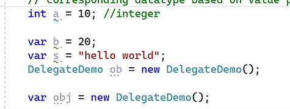
- Rules for var type
  - can be used only as local variable
  - can be used as method parameter
  - multiple variable not supported(var m,n,i;)
  - you have to assign the value while declaring
  - cannot assign null values.

## Nullable

- can be applied for value typed variable
- i.e for int,float,double,long
- not applied for refereced type variables
  - class,object,string,delegates,interface

```c#
int ? i=null;
if(i.HasValue)
{
  cw.(i)
}
else
cw("null");
```

## Extension Methods

- rules:
  - method and class should be static
  - the method should take atleast one parameter

```c#
 static internal class day_6_extensions
 {

     public static Boolean isUpper(this String str)
     {

         return str.ToUpper() == str;
     }


 }
 static class toNumber1
 {
     public static int toNumber(this String str)
     {
         int a = int.Parse(str);
         return a;
     }
 }
     class main
     {
         public void hello()
         {
             String str = "10";
             Console.WriteLine(str.isUpper());
             Console.WriteLine(str.toNumber());
         }
     }
```

## Object Intializer

```c#
products p = new products(){ pid =100,pname="cd"};
```

## Collection Intializer

```c#
var li = new List<products>()
{
  new products(){pid=1,pname="cd"},
  new products(){pid=2,pname="cd1"}
};
```

## Partial Methods

- Partial methods can be used inside the partial class
- partial methods= declaration + implementation;
- Declaration and implementation can be happend in 2 diff files

```c#
void partial method_name();//declaration
method();//iniatization
```

## Anonoumus Type

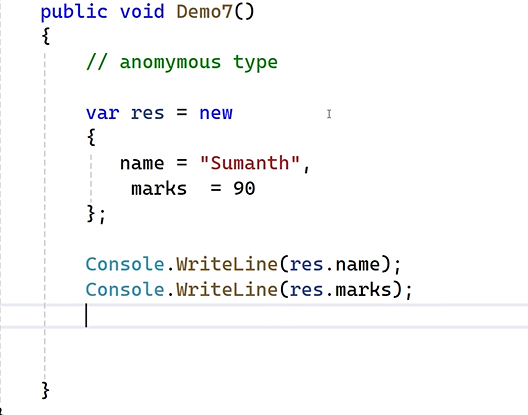

## Lamda Expressions

```c#
public void demo() => Console.WriteLine("HI");
```

## Dynamic Key Word

```c#
dynamic d =10;//type will be check at runtime
var v =10;// type will be check at compile time
//similiar to var but problems  of var is fetched
// the datatype is not fixed can be changed until runtime
//we can make any datatype by delcaring once and can be used in many ways.
```

## Office Progaramability

```c#
internal class day_5_excel
{
    public static void hello()
    {
        dynamic excelApp = Activator.CreateInstance(Type.GetTypeFromProgID("Excel.Application"));
        excelApp.Visible = true; // Make Excel visible

        dynamic workbook = excelApp.Workbooks.Add();
        dynamic worksheet = workbook.Worksheets[1];

        // Write data to Excel
        worksheet.Cells[1, 1].Value = "Hello, Excel!";

        // Save and close Excel
        workbook.SaveAs("d:\\output.xlsx");
        workbook.Close();
        excelApp.Quit();
    }
}
```

## Covariance && Contravariance

- covariance is all about working with two arrays
- for parent=child.
