# Dot Net Core

- it is a new framework from microsoft
- it is same as dotnet framework in this also we can create applications with some advanced supports for devleoping applicaiton
- dot net core is much cloud friendly where as framework does not support cloud technologies.
- we can develop applicaitons on ML,IOT,Cloud,web,mobile,desktop.

## core Vs Framework

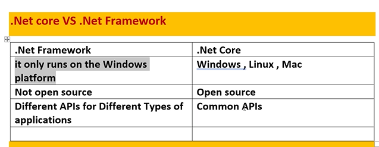

- core is platform independent can run on windows,mac,linux.

## Advantages:

- core is modular it means in references it don't has any packages we can decide what are necessary those can be added i.e its a light weight project
- CLI -command line interface : we can develop a project using command lines in CLI
- in linux we don't have visual studio so for that kind of situation they created CLI.
- core is a cross platform
- Flexible Deployment : we can deploy the project not only in web server but also in docker,azure any where we can deploy our project
- multiple environment and devlopment mode.
  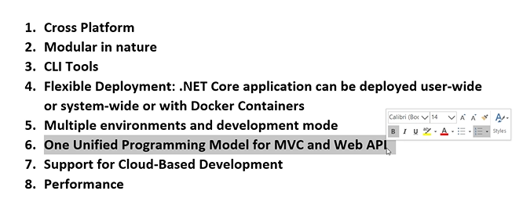

## versions:

- 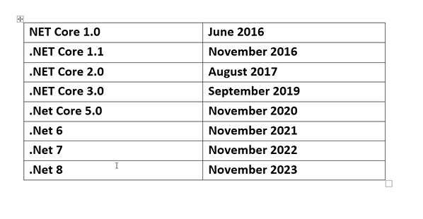

- core clr is the clr for core for multiple platform
- corefx is similar as fcl for core can works for multiple on multiple platforms
- Roslyn compiler it is like a platform where all compilers are placed to compile the c# code it has c#,f# compilers.it used to keep many compilers
- 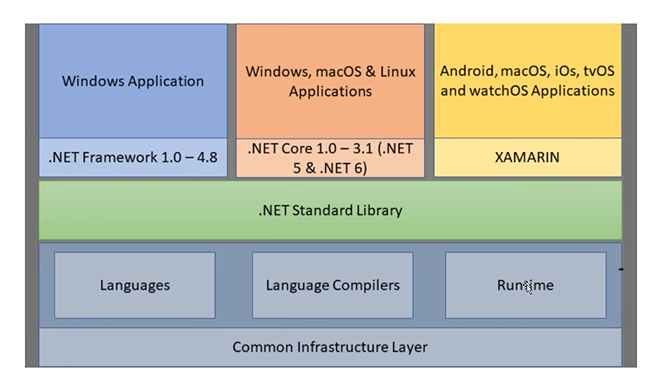
- XAMARIN : helps to build applications which can run on any platforms.

---

- they have removed some features which are specific to a particular platform to be platform independent.
  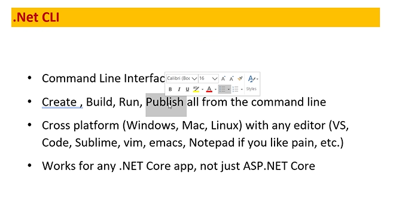
- dontnet --help -- is a command used to show the what we can do in core in command prompt.
- dotnet -l : what are the different projects we can create.

## comamnds

- cd project_name will open that project so that we can run that project
- cd .. - willcome back from that path to the previos project
- dotnet new console -n project_name - will create the new project
- dotnet build -- nis used t conpile rthe project
- dotnet run -- will runs the project
- dotnet new -l -- will returns the list of templates
- dotnet new classlib -n project_name
  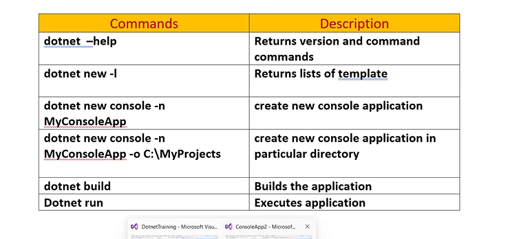
- collection of prjects makes solution(SLN File)
- collection of classes makes projects

## creating own libaray

- create a libary project so that we can use that methods and class anywhere or in any system.
- once we created the libary project it will creates automatically a dll file.
- we cannot run this dll file
- in another system we can also use thois libaray file by psoting this libary globally in git and can be used in another system.

- right click on the projects then add project references -> then it show the list of libraries created by you and then and add then in your project and them import the namespace and we can create objects of that class.
- 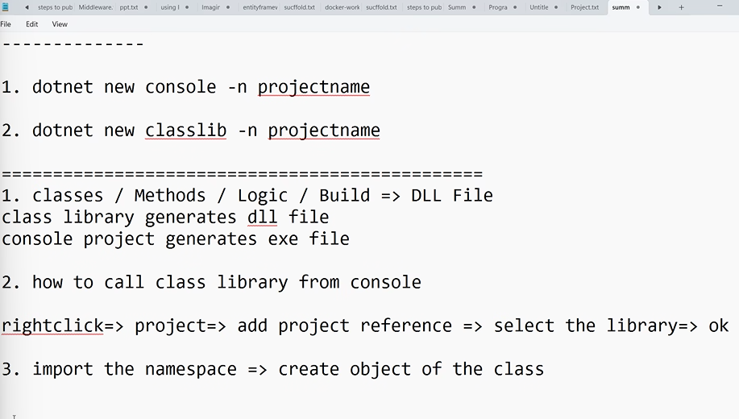

## how to use libaray from github

- 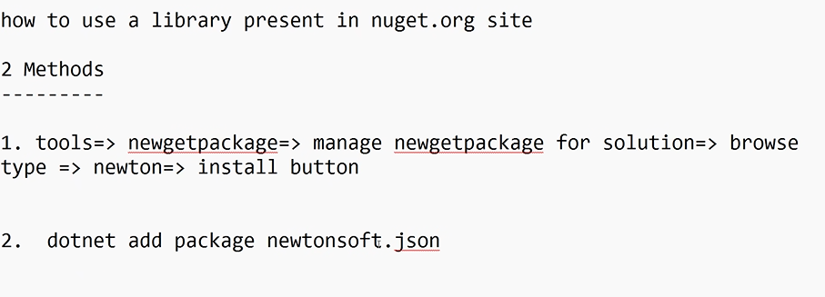

## how to publish packages to nuget

- create class libaray project and write the code
- open .csproj file i.e xml file to open it right click on the libaray project
- then mention the author details,version, date/time,namspace
- right click on project.pack=. generates .nupkg
- nuget.org => upload button => uplaod .nupkg file
- after that it eill take an hour to get publish the library
- 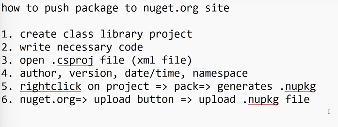

## How to interact with database using dotnet core

## (EF Core)

- Databas First
- 3 packages are to be installed.

  - dotnet add package Microsoft.EntityFrameworkCore
  - dotnet add package Microsoft.EntityFrameworkCore.SqlServer
  - dotnet add package Microsoft.EntityFrameworkCore.Tools

- 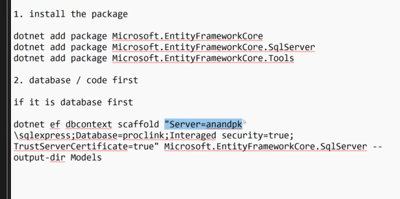
- to connect the database we need to add first packages
- then in command line add this command

```c#
  Scaffold-DbContext "Server=SUMANTH-GETHYD\SQLEXPRESS;Database=proclink;Integrated security=true;TrustServerCertificate=True" Microsoft.EntityFrameworkCore.SqlServer -OutputDir Models -tables employees
  //scaffold means it will create the files of properties and class automatically using this keyword.
```

- it will creates the model in another class we cannot directly call that class with the object so first import the namspace then create the object of that model class where the tables are present.
- this method is called database first.

2. apporach for code first

- create project->install 3 packages -> create class for tables-> add properties
- then build the program after that
- create a class with database name and then create a path or place the path of the sqlserver by inherting the base class and then in constructor we write the path as given below
- 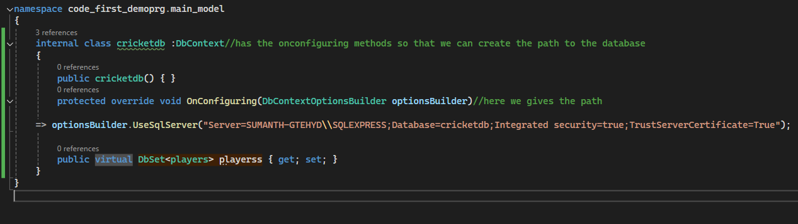
- after that create a dbset properties to perform crud commads or work with
- after that run this two commands

```c#
- dotnet tool install --global dotnet-ef// runned  for one time to use these commands
- dotnet ef migrations add InitialCreate
- dotnet ef database update
- update -Database -Migration second
```

- 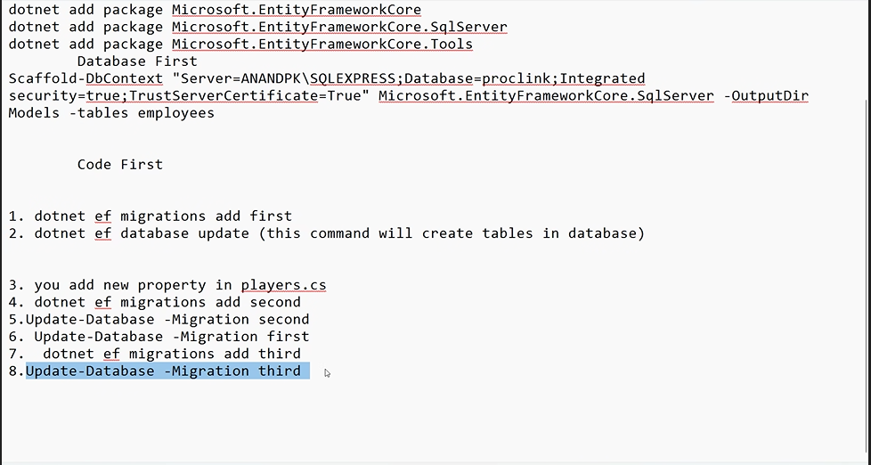

## EF core power tools

- install the package efcore power toools
- then run that application while closing the vs code.
- import the namespace of the model and create the object

```c#
using core_power_tools.Models;
```

## Fornt-end

- parser is a built in compiler in system it is used to compile the html css js code. that tern=m is called parser.
- 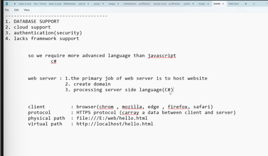
- steps in IIS:
- 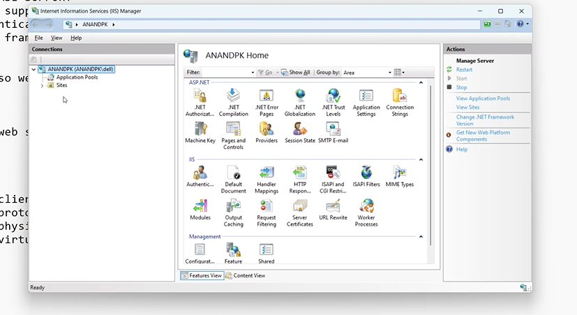
- right click on site
- click on delfault web server
- then clcik on add application
- in alias : add any name for physical path
- select path where the code is there only file (E:web)
- click on ok
- 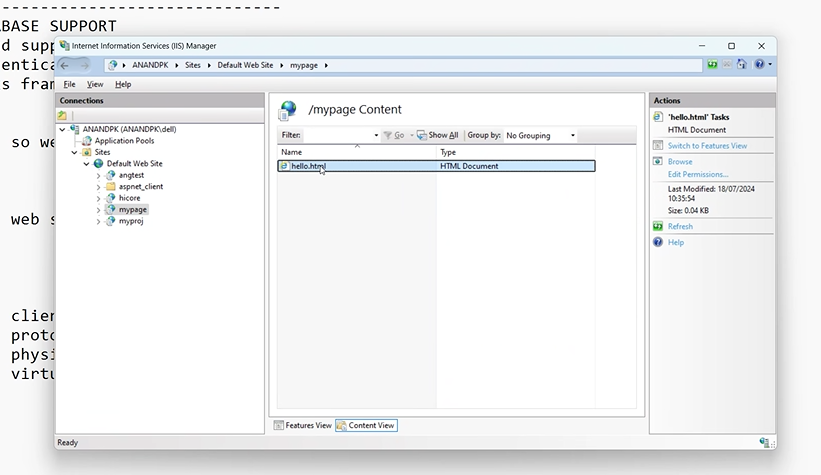
- it shows as above
- then it will be virtual and can be accessable from any system.
- in browser click http://localhost/hello/hello.html

- there are two wasy to develop web applications using dotnet
  1. .Net Frame work(2000)- one way only it is ASP .Net
  2. .Net Core(2016)- we use asp.net or core mvc
     - two ways
       1. asp.net core razer
       2. asp.net core mvc

### ASP.net Vs ASP.NET CORE

- asp is not a cross platform
- it heavy weight needs to write much code
- we needs to install the .net framework to work with frontend
- drag and drop is there in asp.net(adavntage)
- asp only uses IIS with dependent on system.web.dll
- 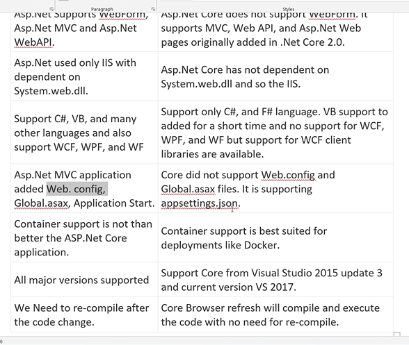
- asp application stores the configuration inforamtion in xml format where as core it is in json . json is better because it is portable.
- container like docker is not supported in asp.net
- 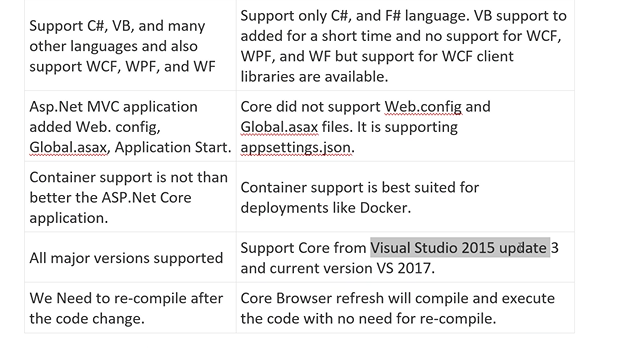
- we need to recompile if we changed the code in asp.net
- we don't need to refresh again an again in browser

### difference b/w razer pages and mvc(Model view controller) pages

##### similarites

- both are cross platforms
- both can run on different platforms

##### diff

- razer is suitable for small projects where as mvc is designed for very large projects
- razer pages lacks in few features compared to mvc
- in simple terms razer is a part of mvc.
- raxer pages each pages contains its own code where as as in mvc all the code os centerailzed

## Razer

- 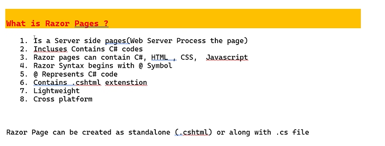
- it is server side pages(web server process the page)
- .cshtml we can write both the code but to write the c# code we need to use @ symbol
- extension is .cshtml
- light weight
- cross platform

### workflow

1. Dependencies : all the downloaded packages and tools are stored in this folder
2. Connected Services : Stores the online servies (web services or web api service)/services used from online .. eg(addtion of two numbers )

- here it will store service references which we can integrate in my application and we can use that service referecenes

3. properties :
   after expand it it has launchsetting.json which contains information about web server.

- kestrol web server is used by .netcore by default
- a type of webserver to run the application on any platform or system
- it has another web server called iis webserver by default by visual studioes.
- IISexpress is a part of vs if we want to use we need to install Vs. but only runs on windows.
- the diff b/w iis and iisexpress is express is a mini version comapred to iss .it is a complete webserver.
- port number is use to differentiate between the websites with the similar name.

- WWWRoot : All client side pages are stored here like html,css,js,bootstrap,xml,json
- we need to store all the client pages here.

- pages : pages contains c# pages. this is where we can store all the razer pages.
  - shared
    - layout : conatins onlu common features
      ex : header part,footer part ,logo,signup information
      - we can store the common things only
  - viewimport : this is a file contains common namespaces
  - the common namespaces which we used in the project is avialable hear
    - view start : this file conatins which layout pages to be used.
    - to apply the layouts to all the child pages we need to call it hear in view start
- AppSettings.json: this file stores the configuration settings
- this stores database path, logging details
- we store the database path here because after publishing i.e deploying the project if there database might change i.e renamed then the client can easily change here if we store it here.
- Program.cs : contains logic to create Kesrtal web server.

  - we can use to cofigure to use authentication
  - session features
  - execption handling
  - instead of giving the execeptions to all the pages we can write it hear and can be appiled to all the pages like cenrtalized.

#### query string is the name to sharing the data b/w to pages. we use <a> to use this method

```html
<div>
  <a
    class="btn btn-warning"
    asp-route-cid="@res.Contactid"
    asp-page="Deletecontact"
    >Delete</a
  >
  <a
    class="btn btn-success"
    asp-route-cid="@res.Contactid"
    asp-page="Editcontact"
    >Edit</a
  >
</div>
```

## get and post methods

- the pages ares stored in kastrol web server.
- it has all the pages like login page something like that.
- as soon as the url is typed the request is goes to the webserver. then it will only process the logic of get method.
- when the page is called first time this get method is intialized.
- intialization code is stored in getmethod.when the page is loaded this getmethod code is executed first.
- the post method is called when the oage is going from client to the server this method is invoked.

#### request to server means getmethod -- to read the data

#### info from client to server means post method

- 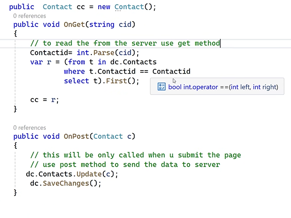
- 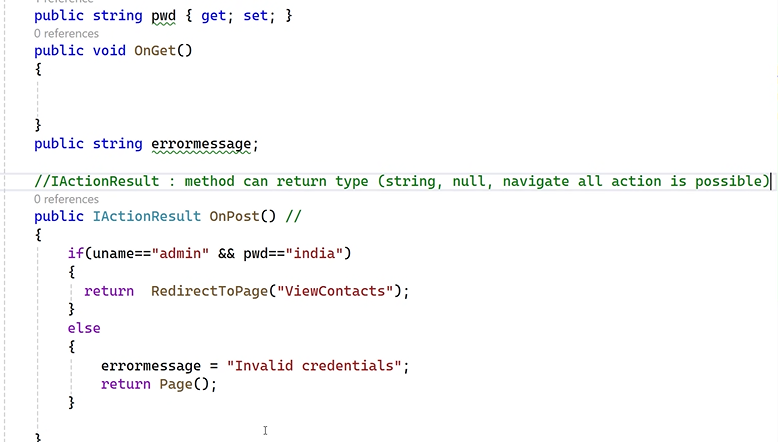

- razer projects are also same as console projects but the thing make the which makes the project razer is the code present in the program.cs page
-

```c#
var builder = WebApplication.CreateBuilder(args);

// Add services to the container.
builder.Services.AddRazorPages();

var app = builder.Build();

// Configure the HTTP request pipeline.
if (!app.Environment.IsDevelopment())
{
    app.UseExceptionHandler("/Error");
    // The default HSTS value is 30 days. You may want to change this for production scenarios, see https://aka.ms/aspnetcore-hsts.
    app.UseHsts();
}

app.UseHttpsRedirection();
app.UseStaticFiles();

app.UseRouting();

app.UseAuthorization();

app.MapRazorPages();

app.Run();
```

- the above code make the project as razer page project

### understanding the code

- var builder = WebApplication.CreateBuilder(args);
  : create Kestrel web server(load the kestrel web sever in the memory) and also load launch settings on json and app setting.json
  - will launches the code which converts the console applicaiton to the webapplication
  - this method will also return object(web application builder) :-
- builder.Services.Services_names : wis is list of features that project support,add servies to the container. all services are mentioned here.
- 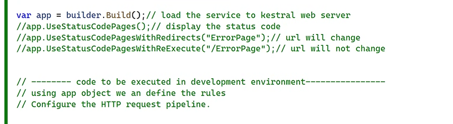
- var app = builder.Build();- load the servcies to kertral web server.
- this build method will return
- using app object we can define the rules.typically used for defing the rules.
- here we mention the flow of the work
  - app.UseAuthenctication();//first run the authenticaiton
  - app.UseRazerPages();//after authentication the razer pages will open.
  - app.UseStatusCode();//will display the status code to the user if the user enter the wrong url.
  - app.UseStatusCOdePagesWithRedirects("Page_name") it will redirect to the page if user entered the wrong url.

```c#
app.UseAuthenctication();//first run the authenticaiton
app.UseRazerPages();//after authentication the razer pages will open.
app.UseStatusCode();//will display the status code to the user if the user enter the wrong url.
app.UseStatusCOdePagesWithRedirects
app.UseStatusCodePagesWithRedirects("errorpage");//will prints the user given page if the user entered the wrong page.and url will change
app.UseStatusCodePagesWithReExecute("/errorpage");//url will not change
code to be executed in a particular environment
if (!app.Environment.IsDevelopment())
{
    app.UseExceptionHandler("/Error");//run time error

app.UseHsts();
}
app.UseStaticFiles();// to run the client side pages it should be written
app.MapRazorPages();//to run the razer pages it should written.
app.MapGet("/hi",()=>"welcome");//if there are no pages then we can write this in program pages like this also
app.Use(async (context, next) =>
{//custom middle ware
    await context.Response.WriteAsync("<div> Hello World from the middleware 2 </div>");
    await next.Invoke();
    await context.Response.WriteAsync("<div> Returning from the middleware 2 </div>");
});
app.Use(async (context, next) =>
{
    await context.Response.WriteAsync("<div> Hello World from the middleware 3 </div>");
    await next.Invoke();
    await context.Response.WriteAsync("<div> Returning from the middleware 3 </div>");
});
app.Use(async (context, next) =>
{
    await context.Response.WriteAsync("<div> Hello World from the middleware 4 </div>");
    await next.Invoke();
    await context.Response.WriteAsync("<div> Returning from the middleware 4 </div>");
});
```

- 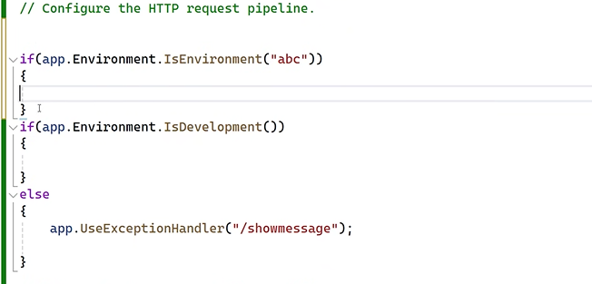

### Building MiddleWare

- sits between client and web server
- 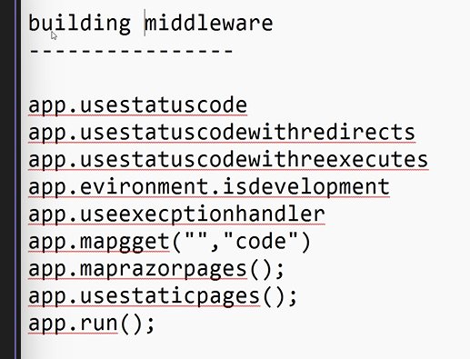

- Depenedencies injection : iam not going to create the object for every page instead only one object is created in program.cs file and is used for every page.
- 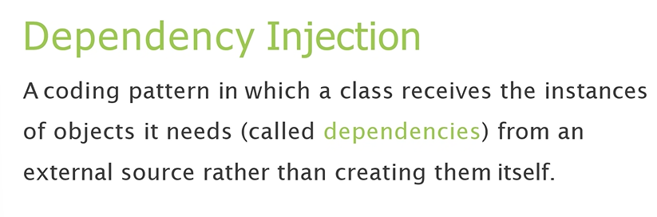

## Builder services

```c#
var builder = WebApplication.CreateBuilder(args);
builder.Services.AddTransient();
//seperate object is created for every request
//similar to the the normal usage like object creation.
builder.Services.AddScoped();
//single object is created for each user
//the example is flipkart adding the products to cart which is can't seen to another user
builder.Services.AddSingleton();
//one object is used by all the user
// can be seen by every user like ticket booking
```

- we need to create an interface to work like this
- 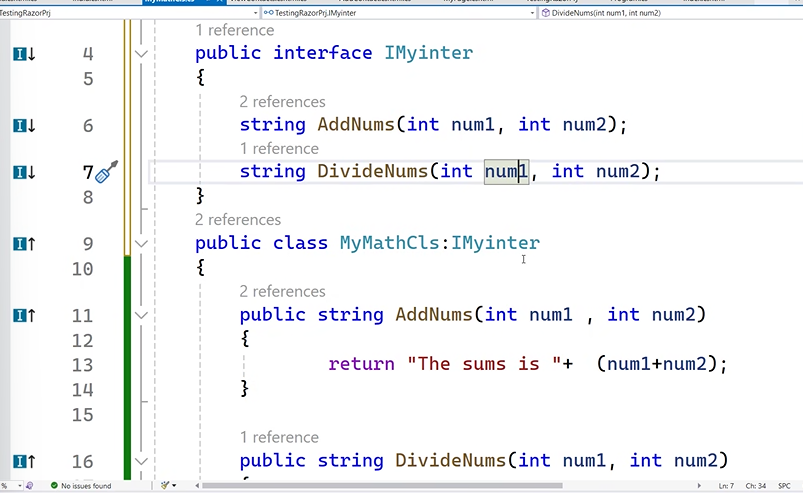

```c#
builder.services.AddTransient<interface_name,class_name>();
```

- to use the interface we need to create a constructor in the class in which we want to use it
- first create the interface and add logic
- add what type of object is to be created in program.cs
- come to the razer pages and call the constructer.

```c#
builder.Services.AddLogging(t => { t.AddConsole(); t.AddDebug(); });//to print the logins
public indiaModel(IMyinter obj, IMyinter obj2, ILogger<indiaModel> l)
{
   i = obj;
   j= obj2;
   l.LogInformation("India class access by the user on :" + DateTime.Now);

}
```

- used to access the webpage with different name as given in the below image.
- we can add alias to the multiple pages

```c#
builder.Services.AddRazorPages(c =>
{
    c.Conventions.AddPageRoute("/india", "abc");
    c.Conventions.AddPageRoute("/addcontact", "xyz");
    c.Conventions.AddPageRoute("/viewcontact", "pqr");
    c.Conventions.AddPageRoute("/deletecontact", "mno");//aslo called directives

});
```

- 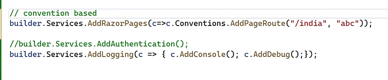
- another method is Page Routing
- 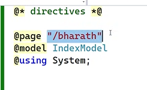
