# SQL SERVER

## Service types :

- Database Engine
- Analysis services
- reporting services :pdf's and charts
- Integration services :
- Azure database services

## Authentication:

- what type of connection
  - windows authenication
  - Sql Authentication - to access the database remotely we can use this(from cloud)

### Master database means it will store the credentials and for security purpose

### Model Database is used to use the sql keywords

- to list the tables present in the database use :- sp_help
- for particular table use :-sp_help table_name
- to rename a table we use :- sp_rename oldname , newname
- to see the databases we use :- sp_helpdb
- this two files are created once we created a databse :- mdffile,ldffile
- data and tables are stored in mdffiles
- logs i.e transactions are stored in this ldffile.
- Msdb databse - it stores the all information about jobs and alerts.(notificaitons about storages ,inforamtion all alters will be notified,jobs means when the query is to be executed i.e on which time the query has to executed)
- temp db : to store the data temporarly and where ever we want rearranging those data is stored in temp database.

### Creatting a database

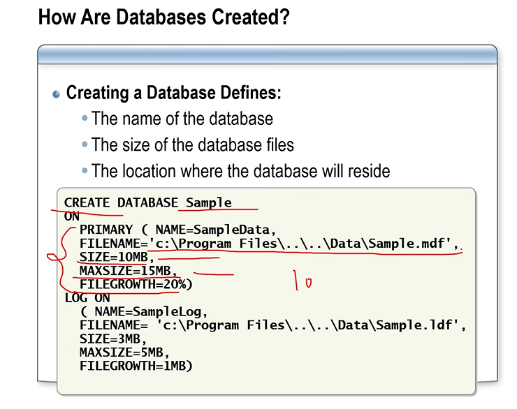
sqlcmd -Window_authenication -Service_name -Database(D) db_name

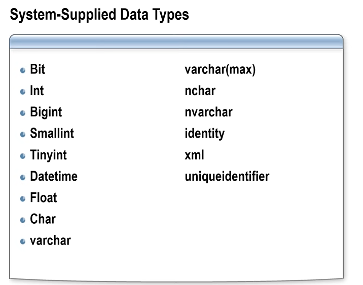
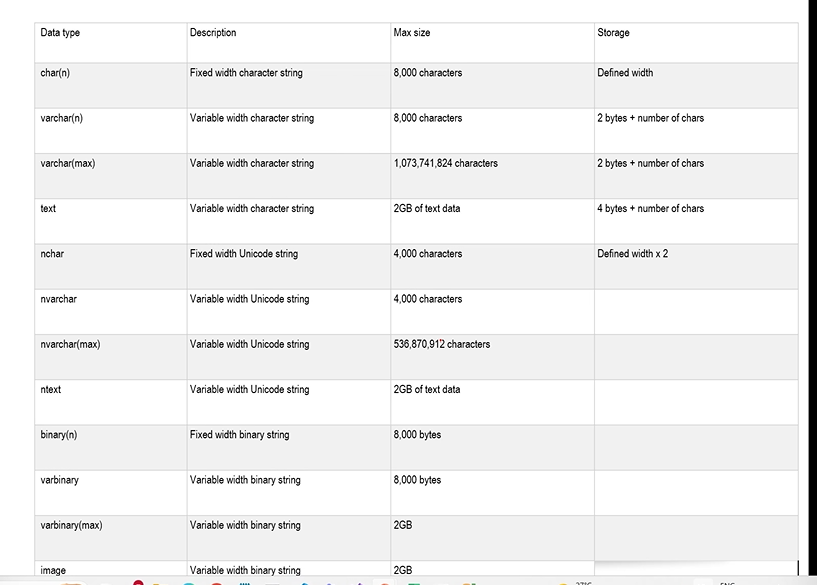
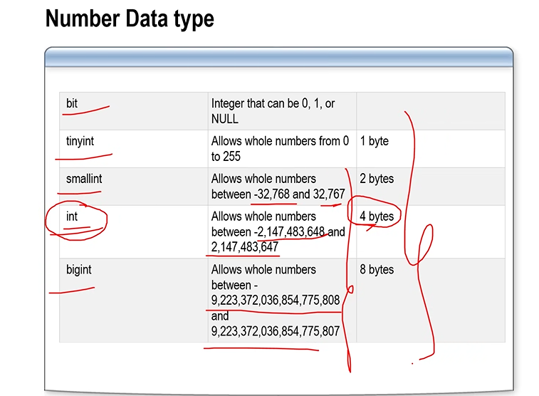
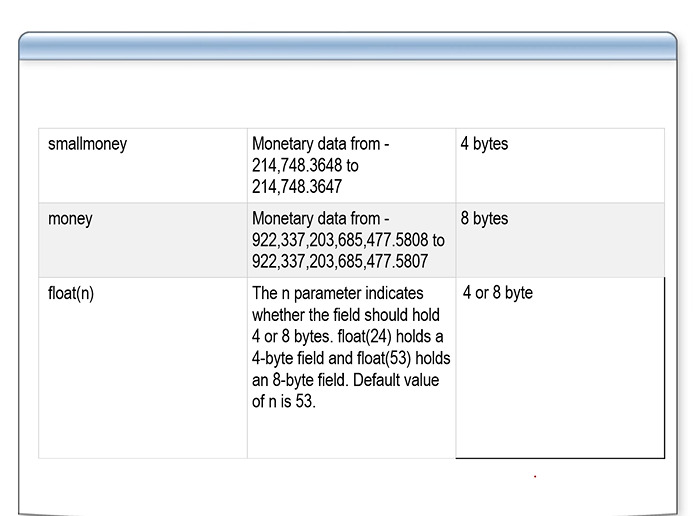
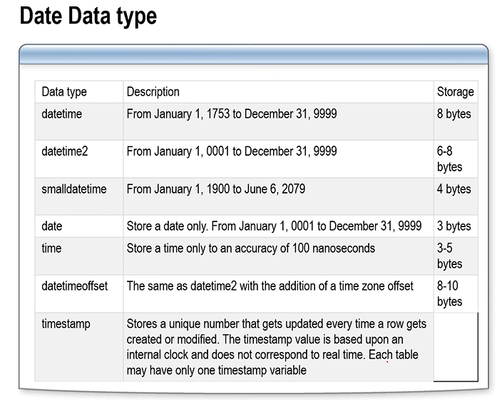
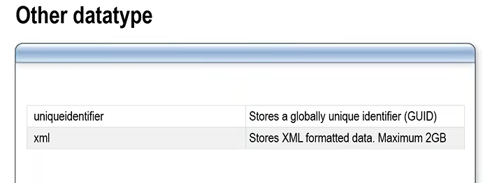

orderid,cust_id,order_date,price,qnty,description,prod_name

## joins

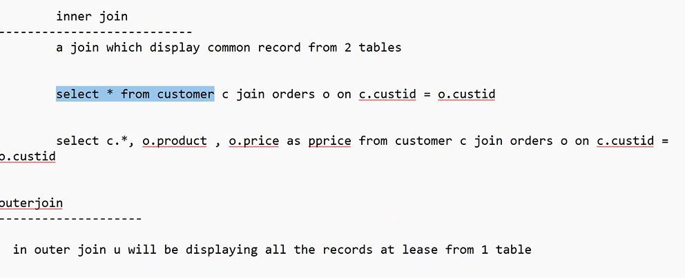
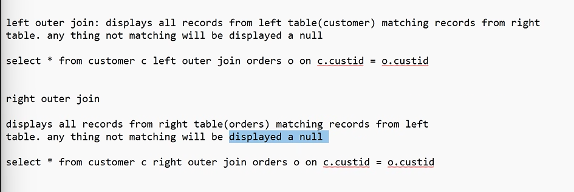

### self joins

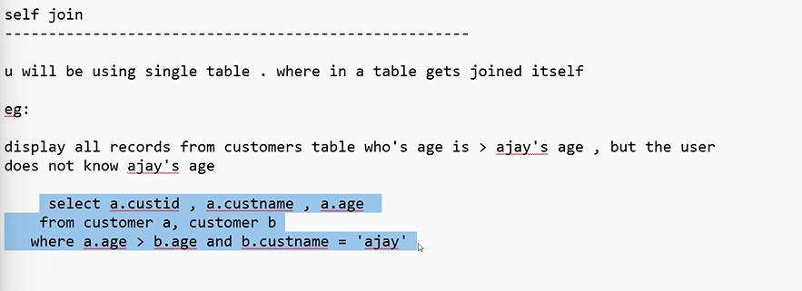

### cross join

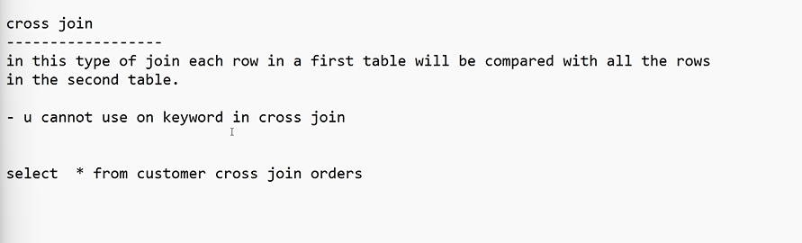

- mostly used for trend setting to compare the present year with all previous years.

## views

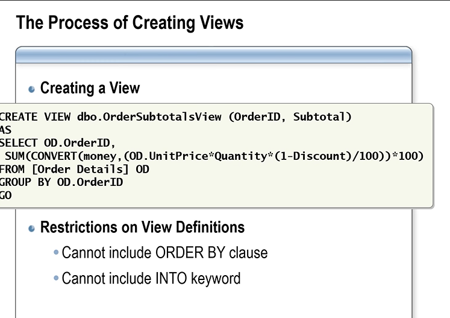
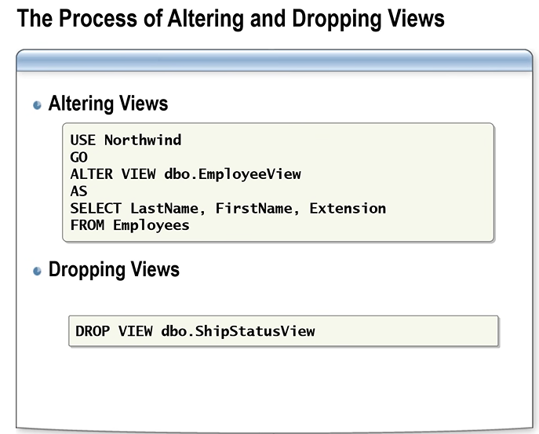
sp_helptext viewname -- will shows the entire source code

- if we don't want show the the data of the views we need to use with Encription -- will hides the queryb info

```sql
alter view myview with encryption
as
select custid from cumstomers
```

- with check options : performs the action(select/update/delete).

```sql
alter view myview
as
select custid from cumstomers where city ="chennai"
with check option
---------
insert into myview (1,"hyd"); -- will throws the error
```

- if we create a view with where condition and used the check option then if we want to insert a new record using views then if the where conditon was satisifed then only the data can be inserted.
- with schema option : cannot drop base table until the view is deleted.

```sql
  create view views
  with encryption,
  schemabinding
  as
  select custid,custname,caddress from dbo.customers
  where caddress='hyd'
  with check option;
  select *from views;
  insert into views values(6,'devil','hyd');
```

## Stored Procedures

- it is a set of TSql(Trnasaction sql) statements which is executed as single unit.
- Accept input paramaneters and return output paraamter values.
- two types

  1. system defined procedures

  - sp_help - will shows all the things present in the db.
  - sp_helpdb,
  - sp_rename,
  - sp_helptext sp_help - will shows the code for sp_help.
  - sp_depends - used for views,
  - sp_helpindex.

  2. user defined procedures

- Advantages :

  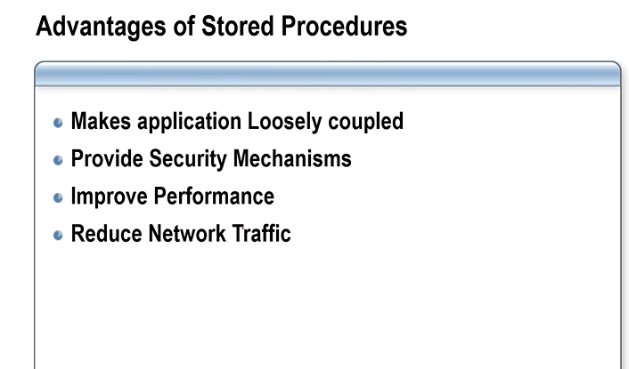

- tightly coupled means if we change somthing in the database like renamed the table name then we need to change the code in the c# which is a disadavantage
- so sp's are useful in the case of loosly coupled.
- provides the security mechanism means if we don't want to show the database name to the c# then we can use this sp's.
- it improve performance because calling procedures is much fatser when compared to calling by queries. becuause using queries first it will be compiled and then it will execute it but by calling sp's compilation is not needed .
- Reduce network traffic : don't have to send the lengthly queries.
- use @@error to show print the error msg

```sql
if(@@error = 8134)
print ' can''t divide with zero'
else return @result
```

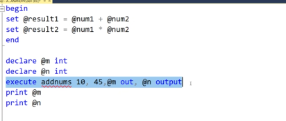

- disadavnatge is we cannot put the procedure name in the select statement.

## Functions

the main adavantage is can put the function name in the select statement

- scalar function
- table valuied function
  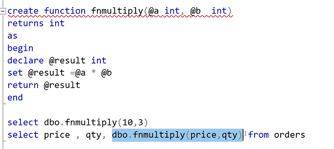
  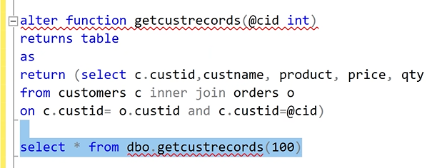

## Triggers

- 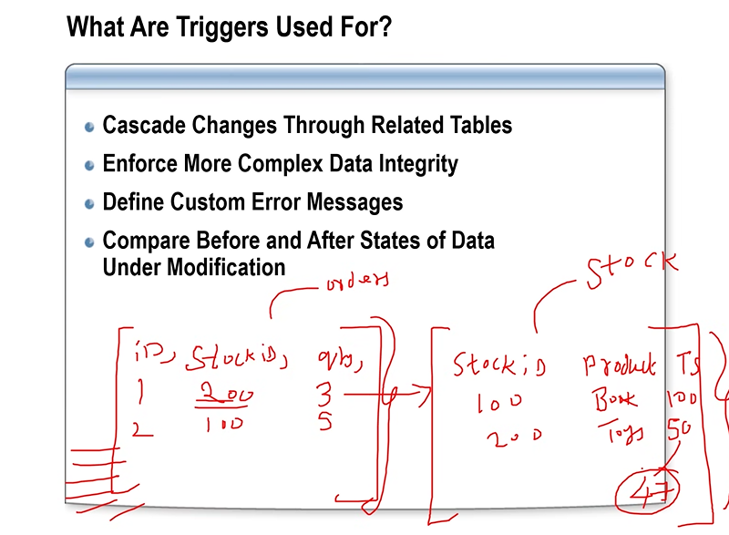
- triggers are called only after the insertion is happend i.e after insertion only the validation is happened.
- 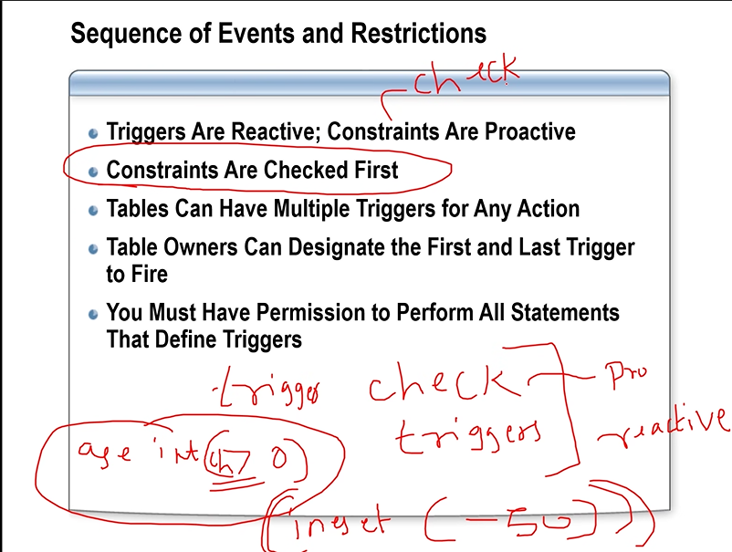
- @@rowcount will says the affected rows in the table.
- all the deleted files are stored in log files i.e it stores the trigger data.
- 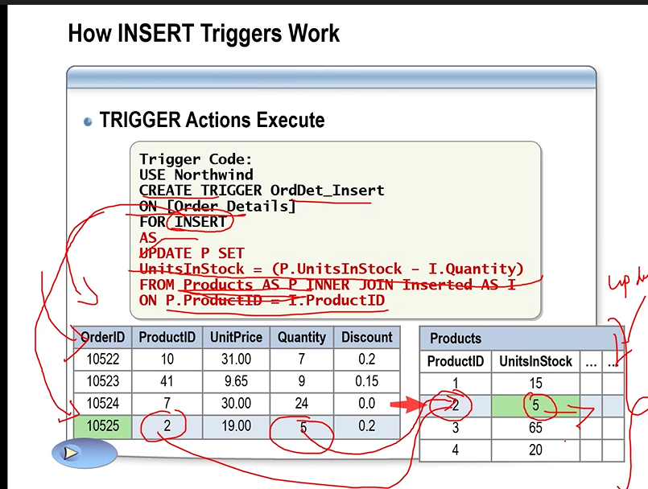
- 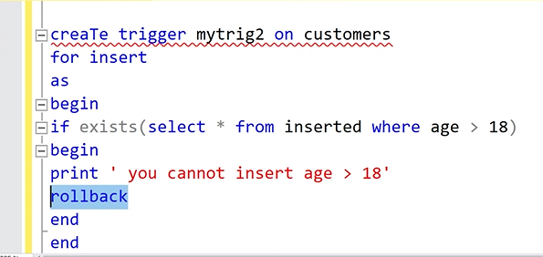

```sql
alter trigger mytrig1 on customers
for delete
as
begin
select * from deleted
end


delete from customers where caddress ='hyd'

creaTe trigger mytrig2 on customers
for insert
as
begin
if exists(select * from inserted where age > 18)
begin
print ' you cannot insert age > 18'
rollback
end
end


insert into customers values(333,'pooja',50,'hyd')


creaTe trigger mytrig3 on customers
for update
as
begin
select * from inserted
select * from deleted
end

update customers set age = 15 where custid =222
```

## Index

- Clustered and non-clustered
- helps to retrive the data faster.
- it will sort the data
- clusterd index is appiled because clusterd index is getting sorted.
- a table cannot have two clustered index. because sorting can happens only one's that's why the table has only one primary key
- A non clustered index can have only a limit 0f 999 indexes and cannot be sorted.
- i/o cost and cpu cost are reqiured in while making the index.
- the draw back of the adding more indexes will cause memory usage wastage.

### B-tree structure:

- heap pages stores the main data i.e child nodes
- root pages:
- intermediate page:
- the searching will happen until end of the pages even if the data is found in middle happens for
  both clustered and non-clustered index.
