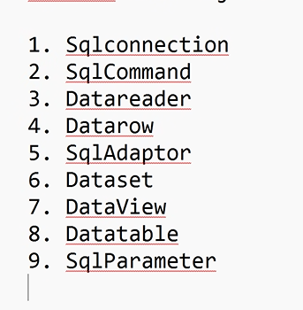
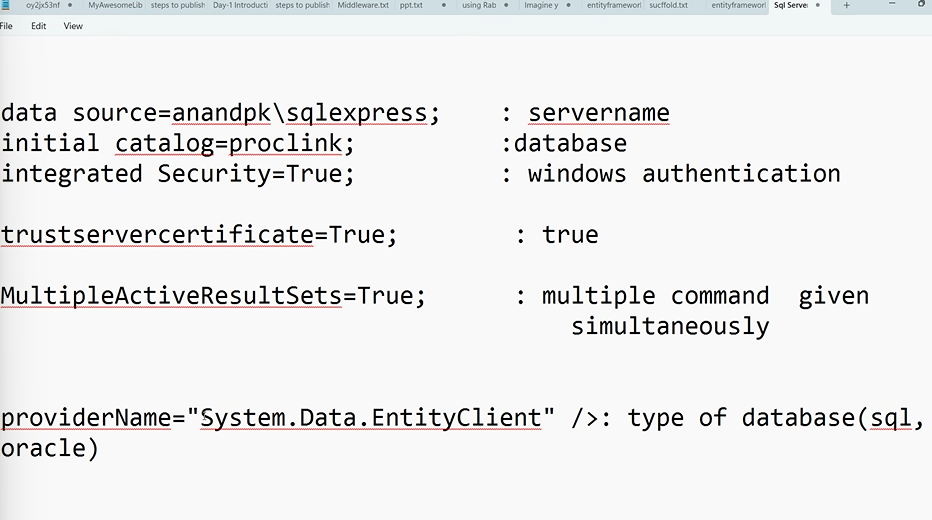
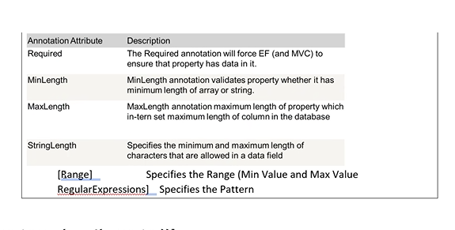

# Entity framework_core

- to interact with database i.e to make a connection between the applications and data we will use the EF.
- .Net => uses ADo.net (activex data object ) similar to JDBC will has the classes.
- the classes int this activex data object are
  
- is an ORM-object relation mapper framework which allows you to easily create and connect to a dabase.
- object is a replcia of the table.
- in link we use objects to get the data
- object is in c#
- relation is in sql(database)
  - back end tables
- mapper(converter)
- we use the link queries in c# to get the database and this EF will converts the link queries into sql queries
- the mapping has happend to the database and frontend.
- the below things are present in referecnes->app.config
- we can name initial catalog as database =proclink;
  s
  

## Validation

- System.CompomentModel.DataAnnotations -- used for validations.
- attributes can be given above class or above properties.
- 

## steps :

- first we need to get the demx file which has the tables for that
- right click on project->add new item ->ado.net entitydatamodel
- type of databse you need to connect
- asks server name ,authentication,database name
- then it will ask for table name/procedures/functions/views
- ok
- after this it will generate class and properties
- it will generate properties for each and every table.

-
- app.config file has complete connection string of the database . it will use this connection to interact with the database.

```c#
    public partial class employee
    {
        [Required(ErrorMessage ="please enter the id!!")]
        public string empid { get; set; }
        [Required(ErrorMessage = "please enter the name!!")]
        [MinLength(4,ErrorMessage ="min length is 4")]
        [RegularExpression("$[a-z]+^",ErrorMessage ="alphabets are required")]
        public string empname { get; set; }
        [MinLength(4, ErrorMessage = "min length is 4")]
        public string emp_designation { get; set; }
        [Range(10000,200000,ErrorMessage ="invaild Range")]
        [Required(ErrorMessage ="enter salary details please")]
        public Nullable<int> Salary { get; set; }
    }

```

- if we update the table or create a table and then after rebuilding the code in

- lazy loading and eager loading
- the the lazy will prints only that table but not primary table.
- eager will prints both primary and foeign key data.

## code first(preferred for larger projects)

- there are two ways to work with database the are:
  - Database first
  - code first
- inorder to write a linq queries using enitiy framework we need a table i.e should be connected with the database.
- but in code first we don't need the with the table
- in this we will create class , properties.
- we will write the entire code in this type
- we also create context class in c#
- we can write the linq queries.
- database and tables are generated in backend automatically.
