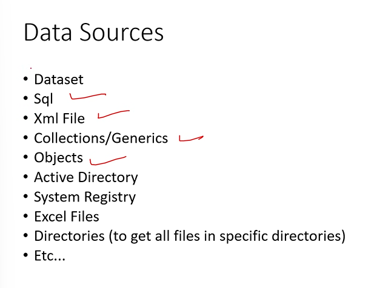
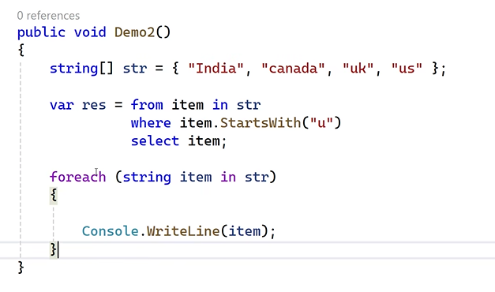
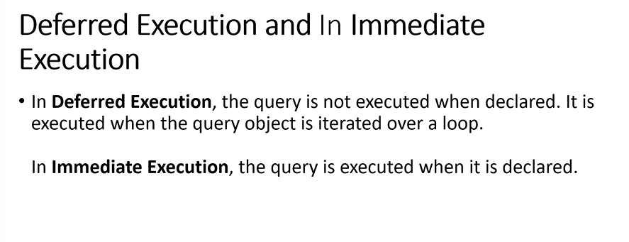
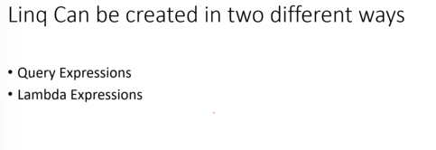

# Linq

- Language integrated query
- introduced in version 3.0
- Linq follows common programming model
- data can be stored in : 
- One logic works for any data
- linw follows common language no matter which data sources we are using.
- the logic will works for every sources i.e common logic for any source.(collection,xml,dataset)
- the common logic means we are writing the queries
- linq supports select,where keywords.

## Linq Classifications

- L2O (Linq to objects) : arrays,Collections
- L2X(Linq to XML) :
- L2S(Linq to SQL)

### Linq to Objects

- LInq starts with from and ends with select keyword
  

```c#
internal class day_6_l2o
{
    List<Products> li = new List<Products>()
    //tjis feature is called colletion intilaizer
    { new Products() { pid = 100, pname = "cd1", price = 120, qty = 4 },
        new Products() { pid = 200, pname = "cd2", price = 220, qty = 4 },
        new Products() { pid = 300, pname = "cd3", price = 320, qty = 4 },
        new Products() { pid = 400, pname = "cd4", price = 420, qty = 4 } };
    public void demo()
    {
        int[] data = { 10, 21, 212, 56 };
        var i = from item in data
                where item%2==0
                select item;
        foreach( var item in i )
        {
            Console.WriteLine(item);
        }
    }
    public void demo1()
    {
        var i =from t  in li  where t.price>5
               select t;
        foreach( var item in i )
        {
            Console.WriteLine($"{item.pid}{item.pname}{item.price}{item.price}{item.qty}");
        }
    }
    public void demo2()
    {
        var i = from t in li
                where t.price > 100 && t.pname.StartsWith("c")
                select t;
        foreach ( var item in i )
        {
            Console.WriteLine($"{ item.pid}{item.pname}{item.price}{item.price}{item.qty}");
        }
    }
    public void demo3()
    {
        var i = from t in li
                where t.price >200 orderby t.pname descending
                select t;
        foreach (var item in i)
        {
            Console.WriteLine($"{item.pid}{item.pname}{item.price}{item.price}{item.qty}");
        }
    }
    public void demo4()
    {


        var res = from t in li
                  select new { productid = t.pid, productname = t.pname };

        foreach (var item in res)
        {
            Console.WriteLine($"{item.productid} {item.productname}");
        }
    }
}
```

## Deffered Execution and Immediate Execution



- in deffered execution the query won't execute if the declaration is made after the declaration the query will be executed
- While compared to immediate execution it will immediatley execute the query even the declartion is happend by using .ToList();

```c#
var res = (from t in li
             where t.price > 1000
             select t).ToList();

   li.Add(new Products() { pid = 600, pname = "Ram", price = 3000, qty = 1 });

   foreach (var item in res)
   {
       Console.WriteLine($"{item.pid} {item.pname} {item.qty} {item.price}");
   }
```



## Lamda Expressions

```c#
public void demo5()
{


    //var res = from t in li
    //          select new { productid = t.pid, productname = t.pname };
    var res = li.Select(t =>new { t.pid, t.pname});
    foreach (var item in res)
    {
        Console.WriteLine($"{item.pid} {item.pname}");
    }
}
```

## L2X(linq to XML)
