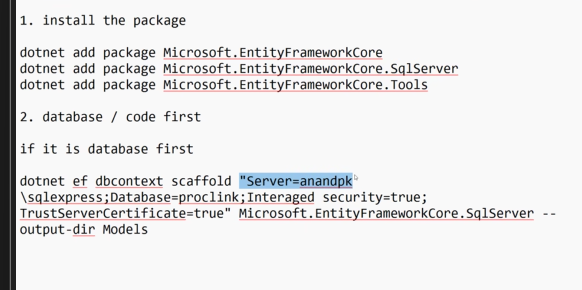
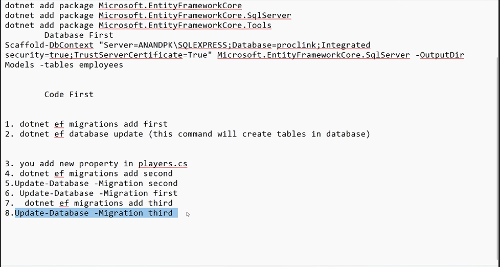

# Entity Framework Core

- To interact with database i.e to make a connection between the applications and data we will use the EFCore.
- There are three ways to interact with the database in EF Core they are
  1. Databas First
  2. Code First Apporach
  3. Use EFCore Tools
- To Connect with the databse we need Three packages which are to be installed they are

  - dotnet add package Microsoft.EntityFrameworkCore
  - dotnet add package Microsoft.EntityFrameworkCore.SqlServer
  - dotnet add package Microsoft.EntityFrameworkCore.Tools

- 
- to connect the database we need to add first packages
- then in command line add this command

```c#
  Scaffold-DbContext "Server=SUMANTH-GETHYD\SQLEXPRESS;Database=proclink;Integrated security=true;TrustServerCertificate=True" Microsoft.EntityFrameworkCore.SqlServer -OutputDir Models -tables employees
  //scaffold means it will create the files of properties and class automatically using this keyword.
```

- it will creates the model in another class we cannot directly call that class with the object so first import the namspace then create the object of that model class where the tables are present.
- this method is called database first.

2. apporach for code first

- create project->install 3 packages -> create class for tables-> add properties
- then build the program after that
- create a class with database name and then create a path or place the path of the sqlserver by inherting the base class and then in constructor we write the path as given below


- after that create a dbset properties to perform crud commads or work with
- after that run this two commands

```c#
- dotnet tool install --global dotnet-ef// runned  for one time to use these commands
- dotnet ef migrations add InitialCreate
- dotnet ef database update
- update -Database -Migration second
```

- 

## EF core power tools

- install the package efcore power toools
- then run that application while closing the vs code.
- import the namespace of the model and create the object

```c#
using core_power_tools.Models;
```
