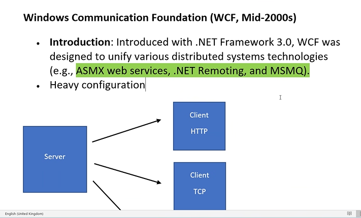

# Web API

### Distributed Computing

- Components of software systems are shared among multiple computers.
- typical software system has three components
- components means interfaces like
  1.  user interface(html,css,js,bootstrap,cshtml)
  2.  Business Logic(controller,classlibrary,cs)/Model
  3.  database(sql/oracle,mysql,Mongo,excel etc..)
      

### Advantages :

1. team members can work simultaniously.
2. Fatser Devlopment.
3. Single point failure can be avoided means if one system fails the data can be persent in the another system.
4. Power of multiple system(Like Ram,HDD).
5. Load balancing means the server will get the multiple requests from many users so to handle that load in one system instead we can manage that requests using multiple systems.

#### Distributed means it can be same network/different network.

- Microsoft way of handling distributed computing

1.  Remoting(.NET)=>RMI(in java)
2.  Web services
3.  WCF
4.  WebApi

### Remoting

- from the year 2000's
- it was introduced for .net Framework
- same operating system should be used i.e for windows.
- used for only .net clients
- all communication used to happen in binary format
  
-

### Web Services

- support the xml format which is supported for all the os or technologies so there is no restrictions to use the methods means here there is no binary format instead it is in xml format which says any system can access that services becuase of these xml format.
- server and client may be in different os and lang. is aslo not a problem.
- the link ends with .asmx

### WCF(Windows commuication FOundation)

- it is a collection of many technlogies
- 
- It is merger of many technology.
- To make the migration is easier to convert the remoting to web servies it will be easy using these WCF.
- it has many service protocols like http,tcp,MSMQ
- but not meant for https.

### DrawBacks

1. Not suitable for begginers
2. xml/binary format
3. Many class are required to master
4. it is not leight weight
5. To many configurations for a simple code many lines are required.
6. Not an opensource

## Web API

- Migration is also possible in web API
- 

#### The priamry purpose of Web APi is to expose the data to various clients.

- follows rest principle(Represntaional State Transfer)
- 

1. one client has to be seperatley and one one server has to be seperatley.(all commuincation should be happend in different system)
2. server will not maintain any information about the client.means once we created webapi any clients can access it
3. Caching menas data should be catched if methods are very complex
4. Layered Systems means usage of mutliple server can be possible.minimum of should be of 1 server
5. self_Descriptive(all communication should happen using http verbs only) means GET/POST/PUT/DELETE

### typical CRUD opr(REST Principle)

- get (READ): Retreives the representaion of the resources means will only show the data
  server->client
- POST : client -> server gives the data to the server
- PUT : to update the details it means it is a put method.
- DELETE : if we want to cancel or delete the data sent to the server. This method is called Delete method.
  

### Advantages

- supports many formats(xml,Json,textformat,custom format)

2. open source
3. platform independent
4. ligth weight
5. simple to use and easy for the beginners

## Practicals

- we need to use [Route("method_name")] if we have more return types
- url should has http://localhost/7708/api/COntrollername/method_name;
- if we wnat to pass the values dynamically then enter ?parameter_name=id in the url.

### How to add data (how post works?)

- [fromquery]-we can pass from the query -
- for custom methods if we want to use the query the names should be mathc with coloums in table
- [frombody]- wer can pass from the body
  -is used to add the data used for put

## JWT Authentication

-json Web Token

- aslo called as token based authentication
  -without authentication the server will process the method and returns the data in xml or json format
- with JWT Authentication the server will not run the method because the server first wants to prove the authentication first.
- the user has to send the username and password first
- the server will validate the credentials,if it is correct it will generate token and sent to client.
- now the client has to use the token to call the method
- the token has an expiry date.
- the token is made of thre layers

1.  Header : type of authentication(like jwt,cookies ..etc)
2.  Payloads : this will says about expiry,claims
3.  signature : is a combination of of header and payload singed with secret key.

- 
- the generating code is written in controller which is executed only once to generate a token
  after that the program.cs file only will gets executed for validations
  

## Advanced Level

1. RABBITMQ
2. Docker
3. Kubernates
4. Azure

## Azure

- azure is cc platform
- we can rent hardware,software,os services,VM

## javascript

-
- syncronus(sequential) and Asyncronus(parllel)
  in sync the methods will execute sequentially and won't execute the second method until the first method gets executed.

```html
 <script>var xhr = new XMLHttpRequest();//to interact with web api
     xhr.open("GET", "https://localhost:7170/api/simple/showall", true);// to get connected with a method true means to call the method asyncronusly(parllel)
     //false means syncronusly(sequential)
```

```html
<!DOCTYPE html>
<html>
  <head>
    <meta charset="utf-8" />
    <title></title>
  </head>
  <body>
    <script>
      var xhr = new XMLHttpRequest(); //to interact with web api
      xhr.open("GET", "https://api.restful-api.dev/objects", true); // to get connected with a method true means to call the method asyncronusly(parllel)
      //false means syncronusly(sequential)
      xhr.onload = function (e) {
        if (xhr.readyState === 4) {
          if (xhr.status === 200) {
            console.log(e);
            document.getElementById("d1").innerText = xhr.responseText;
            var res = JSON.parse(xhr.responseText); //converts the json to javascript array
            res.forEach(function (key) {
              document.getElementById("l").innerHTML +=
                "<li>" + key.name + "</li>";
            });
          } else {
            console.error(xhr.statusText);
          }
        }
      };
      xhr.onerror = function (e) {
        console.error(xhr.statusText);
      };
      xhr.send(null);
    </script>
    <div id="d1"></div>
    <ul id="l"></ul>
  </body>
</html>
```

- to make a method asyn then we need to use task.Run(()=>); so that it will run the method which takes less time to execute

### For realtime projects we need to this:


